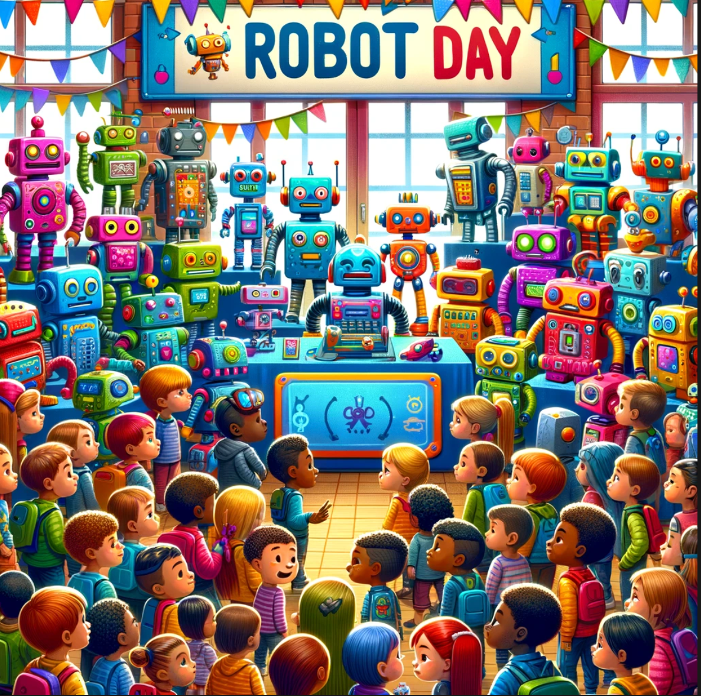

# About The Robot Day Site

{ width="500" }

This Robot Day website was created by [Dan McCreary](https://www.linkedin.com/in/danmccreary/) after he choreographed a successful Robot Day in December of 2023 at the Bakken Science Museum in Minneapolis.  Although he had lots of material for helping organizations create their own Robot Days, the content was spread over many websites.  It was time for all the content
used in creating a Robot Day to come together as one unified resource to support
fast searching and for everyone to share.

## What is Robot Day?

Robot day is where an organization takes over a large room for a single-day event.
The room is configured to allow participants to enter through a door and then be greeted by a person that offers them a challenge such as *"Would you like to take our robot challenge?  If you succeed you will get this robot expert sticker"*.

The participants are then given a checklist of around six "tables" that they must visit to finish the challenge.

The event is configured to show all the components of a collision avoidance robot.  The robot is constructed from around $19 of parts built around a low-cost microcontroller board such as the Cytron Maker Pi RP2040 board.

## Philosophy

If you ask almost any kid these days the question "Do you like robots?" you will invariably get the answer "Yes!".  Kids have a fundamental curiosity about
machines that move around.  Our goal is to **leverage this innate curiosity about the world to teach STEM concepts** - and allow the kids to have a lot of fun while they are learning.  So our core value statement is "Help kids have fun while learning STEM!".

## Finding The "Froebel Gifts" for Teaching STEM

{ width="300" }

In the 19th century, German educator Friedrich Froebel pioneered many of
the ideas we know today as "Kindergarten". Froebel also designed a set
of play materials to provide an idealized learning environment for young children.  These [Froebel Gifts](https://en.wikipedia.org/wiki/Froebel_gifts) were designed as hands-on devices that help children learn
about their world.

Each "gift" was a set of play materials ranging from simple geometric shapes to more complex building blocks and activity sets, intended to stimulate learning through play and exploration in a nurturing environment. These gifts were instrumental in the early development of educational theory and practice, influencing many educationalists and even artists and architects with their emphasis on learning through structured play and creativity.

For the Robot Day project, we seek the "Froebel Gifts" for teaching STEM and robotics.  We know that these items will be physical
devices that the kids will hold in their hands and will help
them discover how the world around them works.  We think we have found a few of these gifts already and we are refining others.

Some of our "activities" and "project boxes" are simple:

1. A battery and an LED in a circuit with a switch.
2. A battery and a motor that you can reverse directions.
3. A [Box with knobs](./activities/rgb-box.md) that mix red, green and blue light.

Other activities are more advanced inside to illustrate ideas:

1. An H-Bridge box that shows current flowing to reverse a motor.
2. A sensor with a display that changes.
3. A collision avoidance robot.

We know there are other clever devices out there we have not yet discovered.  But with your help, we hope we can work together to
develop, refine and test these activities to build awesome learning
experiences for our students.

## Focus on Diversity, Equity and Inclusion

Although there are many wonderful robot kits you can assemble to bring to Robot Day, many of them are out of the price range of many schools, libraries and community centers.  This means that only wealthy schools can afford to
create great educational experiences for students.

But what if we could lower the cost of robotics "labs" to just tens of dollars?  This would mean that even organizations with modest budgets could afford to put on a Robot Day.  Creating fun but low-cost robotics activities takes some clever engineering and testing.

We hope this website inspires every school, library, community center, scout troupe, or summer camp program to host their own Robot Day!

## Focus on Hands-On Activities

I once attended a robotics event that was sponsored by a local University.  They brought two large expensive robots.  But the robots were roped off from the participants. The kids we not allowed near the robots!  **This is not our approach.**  Our goal is to get kids to touch and feel every battery, every motor, every wire, every sensor, every display,
and every robot.  We want the kids to climb into the robot corral and interact with robots close up and personal.  And yes, at every event
we seem to have a few kids (and mentors) step on a few robots. But that
is OK.  We have low-cost interchangeable parts and a lot of hot glue!
We believe that learning happens best when all the senses - including touch - are involved.

## Age Appropriate Activities

A four-year-old girl walks into Robot Day clutching her dad's hand.  She is shy and a little overwhelmed by all the people, noise and activity.  A greeter walks up to her and asks *"Do you like colors?"*.  She nods sheepishly.  The greeter holds up a box with three knobs.  Can you turn this red knob?  As the girl turns the knob a row of lights turns red.  *"Wow!  You made it turn red!  Great Job!"* says the greeter.  *"Now can you turn this green knob?"* - and as she does the lights turn green.  Next comes the blue.  *"WOW! You can program it to make it turn any color!  I bet you are going to be a robot programmer someday!"*
A huge smile breaks out on the girl.

This dialog snippet has been repeated hundreds of times at our events.  We always try to have a few of the little [RGB Boxes](./activities/rgb-box.md) handy for anyone who looks like they need a gentle introduction to robots.

This story illustrates the need for an adaptive set of activities for anyone who enters our events.  Although the event might only be advertised to ages 5-12, you can bet that younger or older siblings will attend.

The [RGB Box](./activities/rgb-box.md) is somewhat of a special case.  It fits magically into the need for a simple, colorful hands-on activity for our youngest audience.  It is a favorite of our staff. Knowing how to create these devices and when to use them will be part of our lessons.

The underlying goal is to be as flexible as possible and not force activities that are not age-appropriate for your audience.  Having a rich set of dialogs ready for each age group used to be challenging.  With tools like ChatGPT, lesson plans for all ages can be generated and taped to the back of the presentation boards.

## Reduced Emphasis on Competitive

There is ample research to show that 

## Creative Commons License

All content is licensed under Creative Commons Attribution-NonCommercial-ShareAlike 4.0 International (CC BY-NC-SA 4.0 DEED)

Please read our [Creative Commons License Agreement](./license.md) for details.
