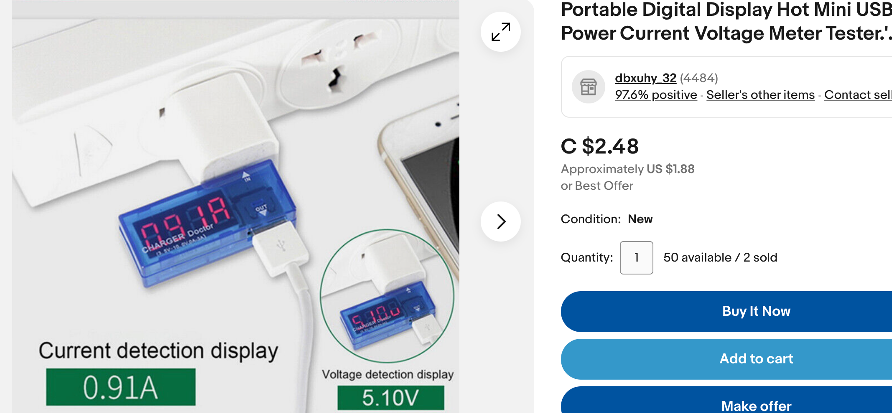
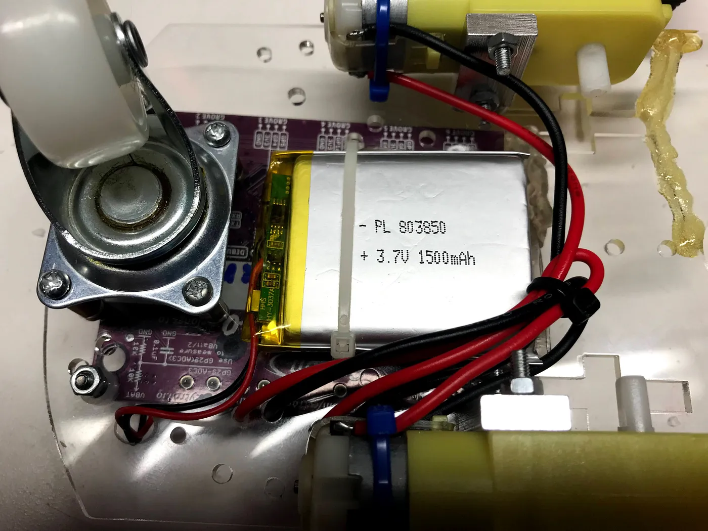
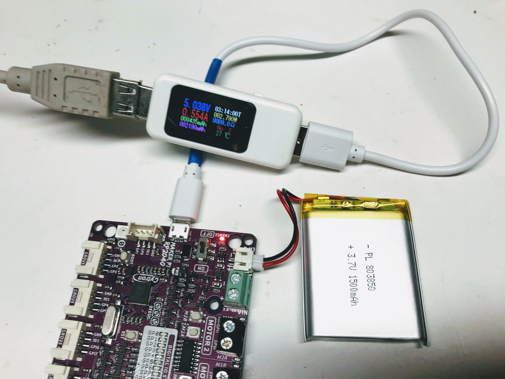
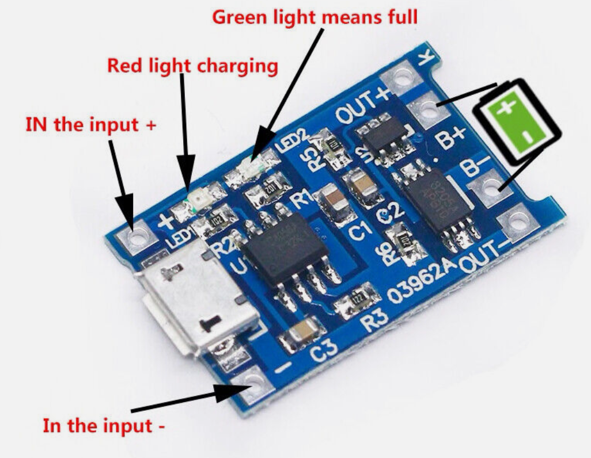

# Battery Recharging

One of the key topics we discuss in our sessions
on batteries is the cost of using disposable batteries.
They not only take up room in our landfills but they
use carbon to manufacture and transport the batteries.

Sustainability is an important topic in many schools and
the battery recharging activities can be a key session to
reinforce lessons on creating sustainability in schools.

Our goal is to try to use more rechargeable batteries in our
Robot Day Events and still keep our kids safe.

!!! Warning
    Never leave recharging batteries unattended.  Batteries
    in robots can become damaged if kids step on them.
    Poor battery management can start a fire.
    Pay special attention to the polarity of any LiPo
    batteries you purchase. The connector polarities are not standardized
    and the batteries you purchase online might have
    a reverse polarity of the boards we use.

## Hands-On Activity

### Materials

{ width=""500"}

1. Several partially charged and fully charged 18360 batteries connected to recharging boards
2. USB current and voltage monitors.  We can get these on eBay for a few dollars.

### Steps

1. Show the parts of the setup including batteries, holder and charge protection board
2. Demonstrate when you plug in the USB port, the recharge board red LED goes on red that the battery is charging.  The USB current meter shows how much current is being drawn to charge the battery.
3. Use a metaphor of "drinking too fast" makes the batteries sick
4. Show that a fully charged the battery will have a blue or green light to show it is fully charged
5. Show that the voltage of a fully charged battery is about 3.9 volts

!!! Note
    Current and voltage are abstract topics and might be better for older students

## Advanced Recharging Topics for Project Builders

We have many projects that are used at regular events.  We have
two places where we use rechargeable batteries.

1. On our robots that use the Cytron Maker Pi RP2040
2. On our projects that just need a single 3.7 volt 18360 battery

Note that we never leave these batteries unattended with our students.

Our big challenge when using rechargeable batteries is to protect the life of these batteries.  We
do this by using special circuits that prevent overcharging or over-discharge.

## Cytron Battery Recharging

The batteries in our robots use 3.7 volt LiPo batters we can purchase for about $12.
They can be attached directly under the Smart Car Chassis using a cable tie.



The Cytron board has connectors for these batteries and the batteries
are automatically recharged when we plug in the USB connector.  The
batteries are rated at 1,500 mAh are they often run at a slow speed
in a robot corral for 2-3 hours.

Here you can see a battery being recharged and drawing about .554 amps.



Battery recharging circuits must limit the amount of current that
is being used to recharge a battery.  You never want to hook
a LiPo batter directly up to a power source!

## Using the TP4056A Lithium Battery Charging Board to Protect Your Batteries



Luckily, we can purchase a small low-cost board for protecting
our batteries.  This is called the TP4056A board.  It has
a USB connector, two connectors for the LiPo battery and
two wires that go into our project.  A red LED is turned on
when the battery is charging and a blue or green light is
turned on once the battery is fully charged.

## Integrating Recharging into Robot Days

Although LiPo batteries can be hazardous, we think by proper management
we can mitigate the risks.  Ask your community to volunteer for
other projects such as families collecting old batteries and
testing batteries.

## Generating Custom Talking Points

### Sample TP4056A Prompt

```
Create a list of talking points for how to use the TP4056A LiPo battery 
recharging board for a 9th-grade robotics class.
Use the image above as a reference.
Mention the USE input, the battery connections and the output terminals.
Mention the red LED to show that the battery is being charged.
Mention the other LED to show the battery is fully charged.
Talk about when these boards are used, the pros and cons and any fire 
danger that could result if the batteries are not handled correctly.
```

### Sample Response

#### Part 1: Components Identification
- Introduce the TP4056A charging board with the uploaded image.
- Identify and discuss the USB connector used for power input.
- Explain the battery connectors (B+ and B-), where the LiPo battery is connected.
- Describe the output connectors (OUT+ and OUT-) for connecting the charged battery to the load.
- Highlight the status LEDs indicating the charging status and full charge.

#### Part 2: Theory of Operation
- Discuss how the charging board operates when a power source is connected to the USB connector.
- Explain how the board regulates charging and prevents overcharging with its built-in circuitry.
- Cover the function of each component to ensure a safe charging cycle.

#### Part 3: Safety First
- Emphasize the importance of handling LiPo batteries with care.
- Discuss common hazards such as short circuits, overcharging, and their potential to cause fires.
- Demonstrate the correct way to connect and disconnect batteries from the TP4056A.
