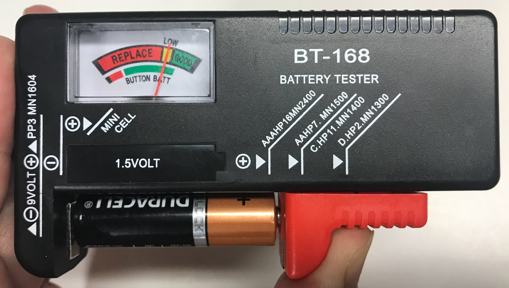
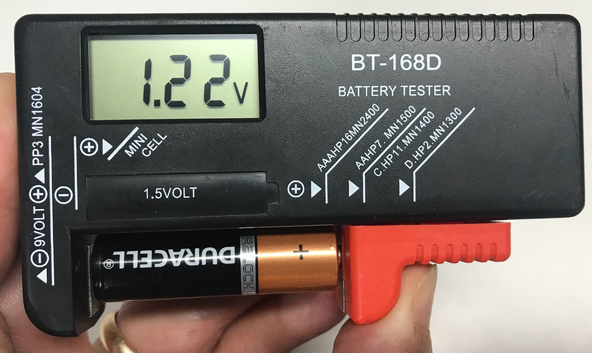

# Battery Testing

Here are two images of battery testers.

We can load the images both into ChatGPT and then ask questions about them.

## ChatGPT Prompt

Given these two images of analog and digital battery tests, design a five-minute discussion you might have with a 5th-grade student who is interested in robots.  The collision avoidance robots need the energy in the batteries to drive around.

## ChatGPT Response

Below is a sample dialog we can use with a 5th-grade student. We
reviewed the dialog and made a few minor changes.

**You:** Hey there! I heard you're interested in robots. That's really cool! Do you know what makes them move around?

**Student:** Yeah! They need power to drive their motors, right?

**You:** Exactly! And that power comes from batteries. Let's look at these two battery testers. Can you tell the difference between the two?

**Student:** One has numbers and the other has a color gauge.

**You:** That's right! The one with numbers is called a digital battery tester. It gives us a precise voltage reading, like 1.22 volts for this battery. The other one, with the colors, is an analog battery tester. It shows us if the battery is good, low, or needs to be replaced.

**Student:** So, which one is better for our robot?

**You:** Good question! For robots, especially the ones that avoid running into things, we need to make sure they have enough power. A digital tester can tell us exactly how much power is left, so we know when to change the battery.

**Student:** What happens if the battery is low?

**You:** If a robot's battery is low, it might not move as fast or react quickly enough to avoid obstacles. That's why we always check the batteries before we start a robot.

**Student:** Can I try testing a battery?

**You:** Of course! Here, use this digital tester and press the battery against the contacts. What's the voltage?

**Student:** It says 1.22 volts!

**You:** Right. And since a brand new AA battery has about 1.5 volts, 1.22 volts means it's been used a bit but should still work. Now let's try the analog tester. What does it show?

**Student:** It's in the green area! So it's good?

**You:** Yes! Green means the battery still has enough power for our robot. Now, if you were building a robot, how do you think you would decide when to change its batteries?

**Student:** Hmm, maybe I'd use the digital one to check if it's below 1.2 volts because then it might not work as well.

**You:** That's a smart idea! With robots, we need consistent power for the best performance. So monitoring the battery life is important. You're thinking like a real robotics engineer now!

**Student:** Awesome! Can we try putting the battery in a robot and see it move?

**You:** Let's do that. Remember, if our robot starts slowing down, what do you think we should do?

**Student:** Check the battery with the tester!

**You:** Perfect! You're ready to keep your robot moving and avoid all those obstacles.

