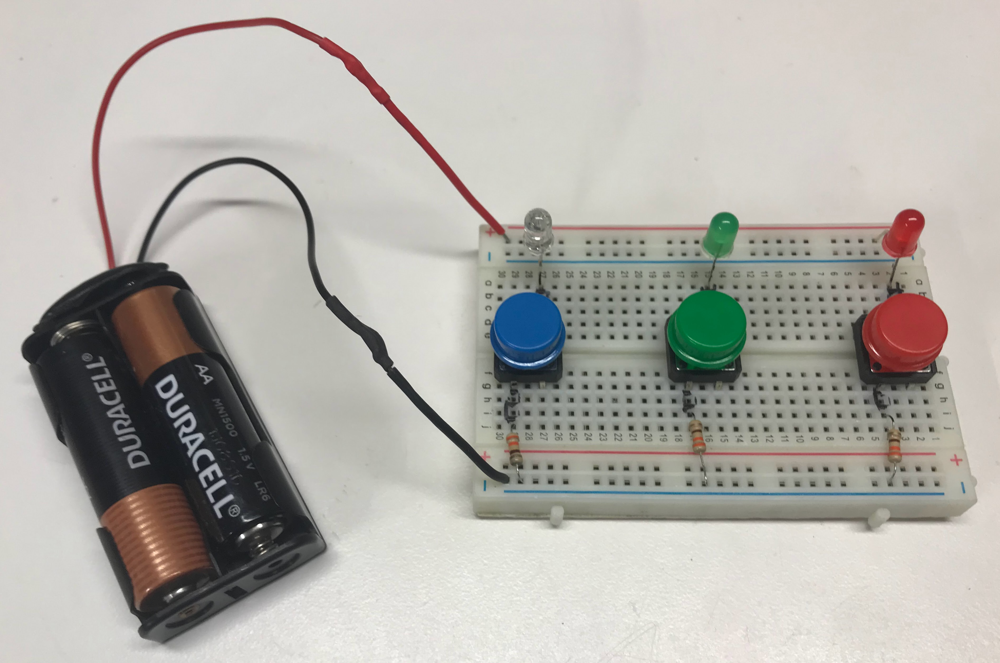
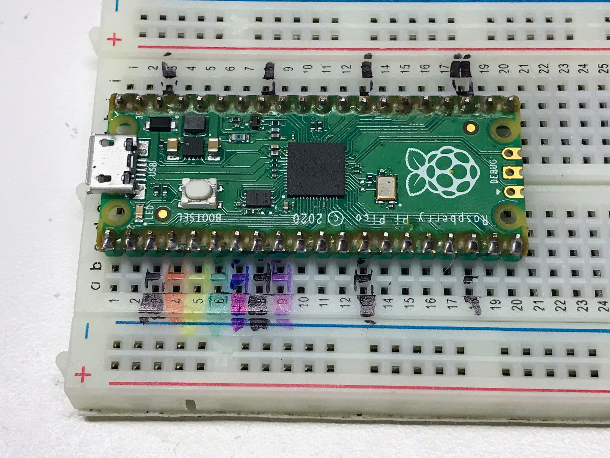
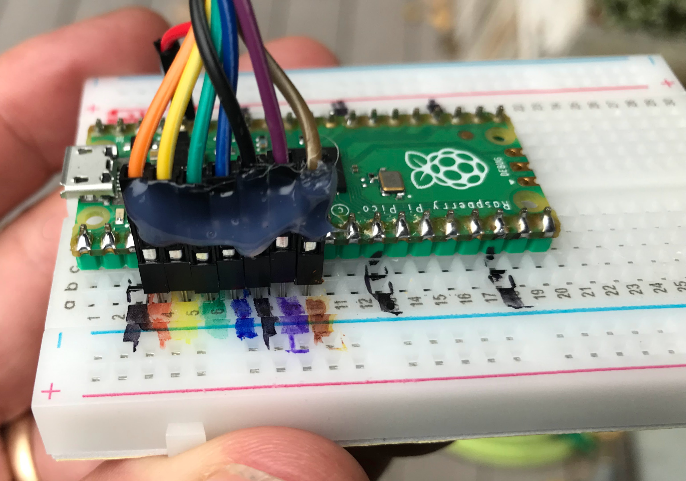

# Robot Day Breadboard Activity

Solderless breadboards are a core tool we use in our Robot Day
activities.  Although most students just see the boards being used
we love to find students who are curious about how these
boards work.


## LEDs on Breadboard

We will be using a combination of breadboards, batteries, LEDs, resistors and buttons to demonstrate circuits.

Here is an example of three LEDs connected to buttons:



Students are each asked to press one of the buttons and
observe the results.  Then they are asked to press multiple buttons together and observe the results.

As a challenge, you can ask them if they could think of
a project that would allow a single button to turn on two
LEDs or an LED that would require two buttons to be pressed together to get an LED to to turn on.

## Pico On Breadboard



Note that each row that ends in "3" or "8" is marked with a
black magic marker so the students can find the right pins.

## Breadboard Display Cable

Note the color of the wires match the colors on the breadboard.



!!! Note
    Using breadboards requires some fine motor skills.  This activity might not be appropriate for students that are easily frustrated
    by small wires that bend easily.

## Discussion with a 5th grade student

### 5th Grade Prompt

```
Consider the image attached.  Create a five minute description of the board on for a 5th grade student at a school's Robot Day event.  Talk about how solderless breadboards are
used to build prototypes of robot projects.  Make sure to talk about power rails and other parts of the breadboard.

Return the response in a single raw markdown file.
```

### 5th Grade Response

Hello, young inventors! Today, I'm going to show you a special tool that helps us build robots. It's called a **solderless breadboard**, and it's very important for making our robot ideas come to life without using any solder—that’s the metal glue that permanently sticks electronic parts together.

Imagine you're creating a Lego castle, and you want to make sure everything fits perfectly before you glue it all together. A solderless breadboard is like the table you build your Lego castle on, but for electronics. You can put pieces on it, take them off, and move them around until everything works just right. That's what engineers do when they're testing their robot designs.

### What is a Solderless Breadboard?

A solderless breadboard is a rectangular board with lots of tiny holes in it. Each hole is connected to certain other holes in a special pattern. You can push electronic components like wires, resistors, and chips into these holes to connect them together and make an electrical circuit.

### Power Rails

On the sides of the breadboard, there are long rows of holes that are called **power rails**. These are like the main roads that deliver power to all the parts of your robot's circuit. One rail is for the positive power, and one is for the negative or ground connection. It's important to make sure you connect your battery or power supply to these rails correctly, or your circuit won't work!

### Building a Circuit

When you're building a circuit on a breadboard, you follow a diagram that tells you where to put each part. It's a bit like following a treasure map to find the treasure. Instead of X marking the spot for treasure, the diagram shows you where to place each component to make your robot do amazing things.

### Why Use a Breadboard?

Using a breadboard is great for testing because you can easily change parts of your circuit. If something doesn’t work, you can just pull out the parts and try something else. This is perfect when you're just starting to learn how to make robots because it lets you experiment and learn without any mistakes being permanent.

Now that you know about the breadboard, you're on your way to becoming a robot-building expert. Have fun creating your very own robot circuits and bringing your incredible ideas to life!
