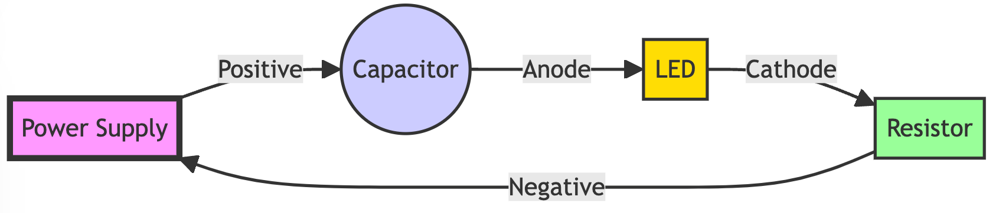

# Electronics Starter Kit


For under $15, you can purchase an [Electronic Component Starter Kit](https://www.ebay.com/itm/314928530461).

## Kit Components


These kits include items such as

1. Full-sized breadboard - 830 tie-points
2. 65 wire connections (aka jumpers)
2. USB power connector (switchable from 3.3 volts or 5 volts)
3. 50 LEDs (10 each of red, blue, green, yellow and white)
4. 100 resistors (ranging from 10 to 1M ohm)
5. 10 momentary press buttons
6. Buzzer for generating sound
7. 20 X female-to-male ribbon connector (Dupont connector)
8. 2 X pin header (40pin)
9. Potentiometer
10. 2 photoresistors
11. Thermistor for measuring temperature
12. 5 X diode rectifier (1N4007)
13. 5 X NPN transistor (PN2222)
14. 4N35 optocoupler
15. 74HC595 shift register
16. 30 capacitors

## Sample Prompt

```linenums="0"
Our 9th grade robotics class just purchased these electronics starter kits.  The components are listed in the attached photo and the list above.

We have done lesson plans on LED circuits and used buttons to turn
the LEDs on and off.

What additional lesson plans would you recommend?
```

## Sample Response


**Title:** 9th Grade Robotics Class - Electronics Kit Lesson Plans

### 1. Sound and Light Show with Buzzers and LEDs
**Objective:** Understand how to generate different tones with a buzzer and create a light show with LEDs.

#### Lesson Plan:
- Teach about frequency and the pitch of sound using the buzzer.
- Program the microcontroller to control the buzzer and create different tones.
- Create a circuit to blink LEDs in patterns synchronized with the buzzer tones.

### 2. Temperature Sensing with Thermistor
**Objective:** Learn about temperature sensors and data logging.

#### Lesson Plan:
- Discuss resistance change with temperature.
- Set up the thermistor in a voltage divider connected to an analog input.
- Record and visualize temperature changes over time.

### 3. Automatic Night Light Using Photoresistors
**Objective:** Build a circuit that responds to light levels.

#### Lesson Plan:
- Teach about photoresistance and light level detection.
- Create a circuit with a photoresistor that turns on an LED in the dark.
- Experiment with resistor values to change light sensitivity.

## 4. Introduction to Digital Electronics with Shift Registers
**Objective:** Learn about serial communication and pin expansion with a shift register.

#### Lesson Plan:
- Explain shift registers and their role in increasing microcontroller outputs.
- Use the 74HC595 to control multiple LEDs.
- Design a simple binary counting challenge or light sequence memory game.

### 5. Simple Alarm System
**Objective:** Create a security system using buttons and buzzers.

#### Lesson Plan:
- Discuss buttons as switches in a circuit.
- Wire buttons as 'sensors' for a simulated door/window.
- Program the buzzer to sound when a button is pressed.

### 6. Electronic Dice Using Random Number Generation
**Objective:** Understand random number generation and display using LEDs.

#### Lesson Plan:
- Discuss random number generation.
- Set up LEDs in a die pattern and light up a random number when a button is pressed.

### 7. Capacitor Charge and Discharge Experiment
**Objective:** Learn about capacitor behavior in a circuit.

#### Lesson Plan:
- Set up a circuit with a capacitor and an LED.
- Measure and record capacitor charge and discharge times with different values.

### 8. Optocoupler as a Switch
**Objective:** Explore the use of an optocoupler as an electronic switch.

#### Lesson Plan:
- Teach about electrical isolation and optocouplers.
- Create a circuit where the 4N35 controls another circuit part without direct connection.

### 9. Potentiometer as a Control Device
**Objective:** Use a potentiometer to adjust an LED's brightness or a buzzer's tone.

#### Lesson Plan:
- Explain the potentiometer as a variable resistor.
- Connect it to an LED to change brightness.
- Advanced: Control the buzzer frequency, creating a simple instrument

These lesson plans are designed to be engaging and to build on the knowledge your students have already gained from working with LEDs, resistors, and buttons. They can be scaled in complexity depending on the students' proficiency and interest levels.

## Deep Dive into RC Circuit

### RC Circuit Prompt

```linenums="0"
Please create a detailed lesson plan for item 7: Capacitor Charge and Discharge Experiment.  Describe the circuit, its components and how it would work.

Please create a Mermaid diagram that describes the circuit.
```

### Circuit Diagram



### Mermaid Format

```
graph LR
    A[Power Supply] -- Positive --> B((Capacitor))
    B -- Anode --> C[LED]
    C -- Cathode --> D[Resistor]
    D -- Negative --> A
    style A fill:#f9f,stroke:#333,stroke-width:4px
    style B fill:#ccf,stroke:#333,stroke-width:2px
    style C fill:#fd0,stroke:#333,stroke-width:2px
    style D fill:#9f9,stroke:#333,stroke-width:2px
```

### RC Circuit Diagram Response

**Title:** Lesson Plan Detail: Capacitor Charge and Discharge Experiment

## Objective:
Students will learn about the electrical properties of capacitors, specifically their ability to store and release energy. They will observe and measure the time it takes for capacitors to charge up and discharge through an LED.

## Materials Needed:
- Capacitors of various capacitances (e.g., 10µF, 100µF, 1000µF)
- LEDs
- Resistors (to limit current through the LEDs, e.g., 220Ω)
- Multimeter with capacitance and time measurement capabilities
- Breadboard
- Jumper wires
- Power supply or batteries
- Stopwatches or timing software

## Circuit Description:
The circuit for this experiment is straightforward. The capacitor will be charged from a power supply and then discharged through an LED. A resistor will be placed in series with the LED to ensure that the current does not exceed the LED's maximum rating when the capacitor discharges.

## Step-by-Step Guide:

1. **Introduction to Capacitance:**
   Begin the lesson by explaining the concept of capacitance and how capacitors store energy. Discuss the formula \( Q = CV \), where \( Q \) is the charge, \( C \) is the capacitance, and \( V \) is the voltage.

2. **Circuit Building:**
   Guide the students to construct the circuit on a breadboard. Start by connecting the positive terminal of the power supply to one lead of the capacitor. Connect the other lead of the capacitor to the anode (longer lead) of the LED. Then connect the cathode (shorter lead) of the LED to one end of the resistor, and connect the other end of the resistor to the negative terminal of the power supply.

3. **Charging the Capacitor:**
   With the power supply turned off, explain the process of charging the capacitor. Then, turn on the power supply to charge the capacitor to a known voltage. The LED will light up briefly as the capacitor charges.

4. **Observing Discharge:**
   Once the capacitor is fully charged, disconnect the power supply. The LED will emit light as the capacitor discharges through it. The brightness of the LED will decrease as the capacitor's stored energy decreases.

5. **Timing the Discharge:**
   Have students use a stopwatch or timing software to measure the time it takes from when the LED turns on until it turns off. They should record this time along with the capacitance value.

6. **Repeat with Different Capacitances:**
   Repeat the charging and discharging process using capacitors of different capacitances. Have students observe how the time for the LED to turn off changes with capacitance.

7. **Data Analysis:**
   After collecting data for different capacitors, guide students to plot the discharge time against capacitance. They should notice that the time increases with capacitance.

8. **Discussion:**
   Conclude with a discussion about how the experiment demonstrates the capacitor's ability to store and release energy. Discuss practical applications where capacitors are used for their ability to quickly release energy, such as in flash photography, power conditioning, and as part of timing circuits.

9. **Safety Tips:**
   - Make sure the voltage applied does not exceed the capacitor's voltage rating.
   - Ensure the LED current does not exceed its maximum current rating by using a suitable series resistor.

10. **Extension Activities:**
    For advanced students, introduce the concept of the RC time constant (\( \tau = RC \)) and how it defines the charging and discharging rates of a capacitor in an RC circuit.


