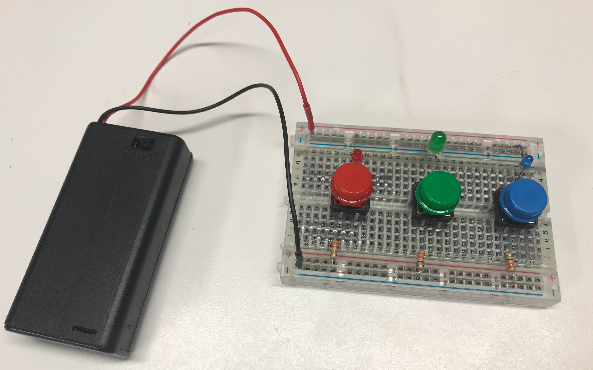
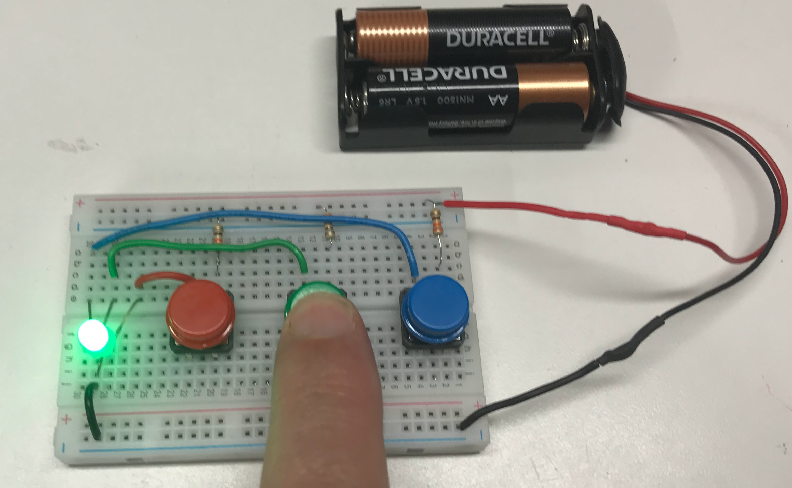
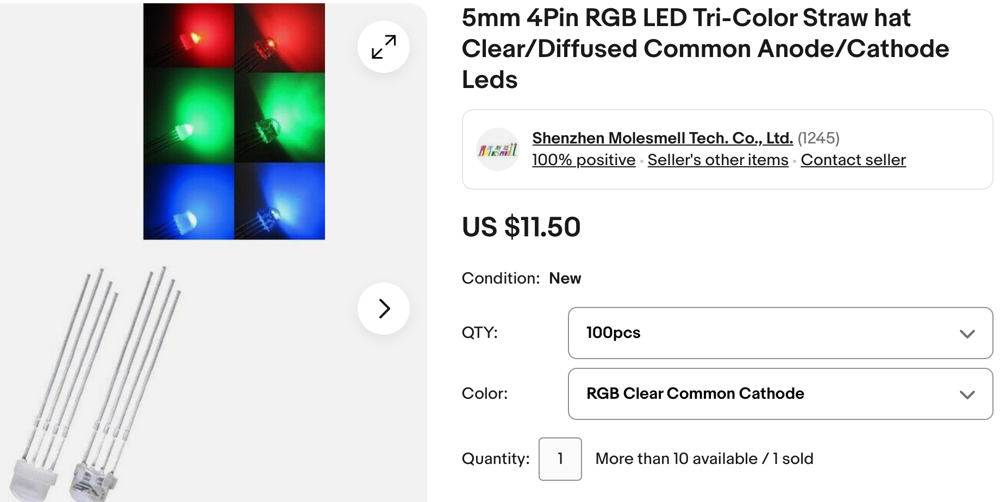

# RGB LEDs






Make the following combinations

1. Red only
2. Green only
3. Blue only
4. Red and Green together (yellow)
5. Red and Blue together (purple)
6. Green and Blue together (cyan)
7. All three on (white)

## Prompt

```
The image above is an RGB LED mounted on a breadboard with a battery connected.
Create a five-minute discussion about this board between a volunteer in a Robot Day RGB LED challenge and a 5th-grade student.  Mention that by pressing individual buttons you can make red, green or blue.  By pressing multiple buttons other colors can be made.  Have the student try pressing some buttons.  What concept can we teach?

Return your response as a markdown download file.
```
## Response

**Volunteer:** Hi there! Welcome to our Robot Day RGB LED challenge. Have you ever seen one of these before?

**5th-Grade Student:** No, what is it?

**Volunteer:** This is a breadboard, and that little device with the wires is an RGB LED. RGB stands for red, green, and blue. By pressing these buttons, we can make those colors light up. Do you want to try it?

**Student:** Sure! *Presses the red button*

**Volunteer:** See, you've made the LED glow red! This happens because you've completed the circuit for the red part of the LED. What do you think will happen if you press the green button at the same time?

**Student:** *Presses the green button* It's yellow now!

**Volunteer:** That's right! When you mix red and green light, you get yellow. This is a concept called color mixing, and it's how we can create lots of colors on screens and in lights. By pressing different combinations of buttons, you can make different colors. 

**Student:** What happens if I press all three?

**Volunteer:** Give it a try and let's see!

**Student:** *Presses all three buttons* It's white!

**Volunteer:** Exactly! When you mix red, green, and blue together, you get white light. This is a little bit like mixing paints, but with light, it’s called additive color mixing. It's how devices like your TV or tablet screen work to make all the colors you see. What do you think you're learning by doing this?

**Student:** I'm learning how colors mix together and how lights can make different colors!

**Volunteer:** That's perfect! And this is just one of the many cool things you can learn and do with a simple breadboard and some electronics. You're also learning about circuits and electricity, and how by combining different parts you can make something new. What color do you like best?

**Student:** I like blue!

**Volunteer:** Then press just the blue button, and there you have it. You can even try to get different shades by pressing the buttons with different timing. Would you like to try that too?

**Student:** Yes, that sounds fun!

**Volunteer:** Go ahead! This is all about experimenting and learning. And remember, the more you play with it, the more you'll understand how it works. Enjoy the rest of the STEM day, and keep exploring!

## Parts

These RGB LEDs are about 12 cents each in qty 100 on [eBay](https://www.ebay.com/itm/192621925980).
You can search for "4pin 5mm RGB Tri-Color Common Cathode LED light Red Green Blue"

