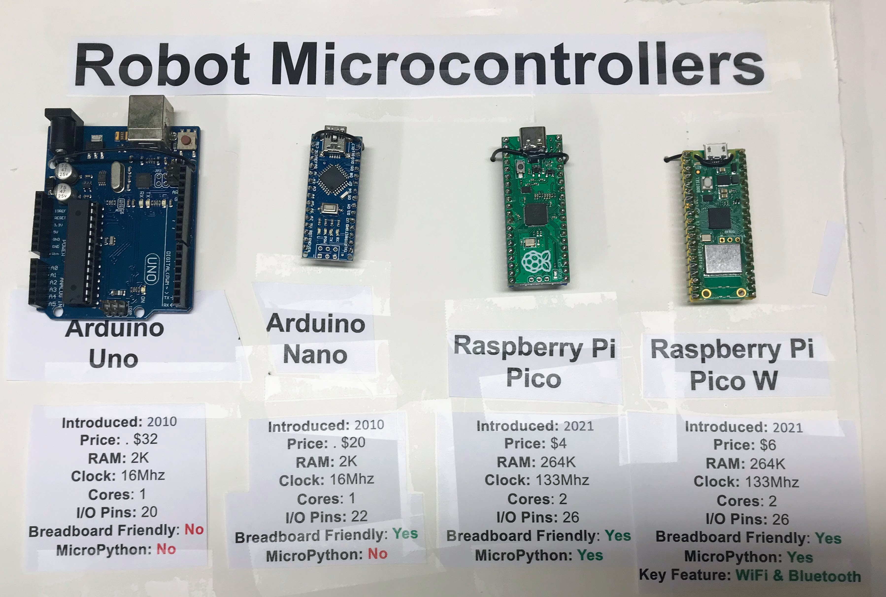

# Robot Day Microcontroller Labs

In this lab we are going to compare the last generation of microcontrollers with the new generation.

The last generation was called the Arduino.  The new generation is called the Raspberry Pi Pico.  Lets compare the memory graphically:

## Memory Comparison

Memory is really important in computers.  The more RAM memory you have, the better.  It means you can work on really fun problems without slowing down.

## Memory Usage

Now let's look at how we use this memory when we program graphic displays using MicroPython.

We can see that Python can't run on the old 2K Arduino Uno since it needs about 16K of RAM to run.

Using a framebuffer for a monochrome display is easy.  But powering a color smartwatch takes a LOT more memory.

## Clock Speed

Imagine you are running a race.  In a given amount of time, like one minute, a turtle will only go 16 feet.  But a rabbit could travel 133 feet.  This
is how we compare how quickly the old turtle Arduino compares with the
ultra-fast rabbit of the Raspberry Pi Pico.

