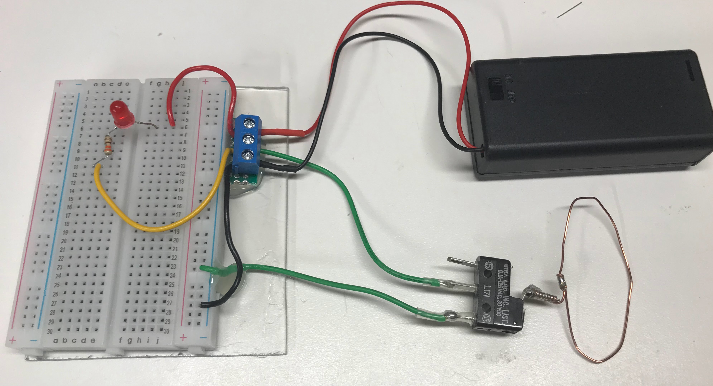

# Microswitchs
s
Microswitchs are a good entry point into a sensor for a collision avoidance robot.  Although technically we are touching the wall, kids will get the idea of feedback.  We can purchase microswitches like [this one on eBay](../img/microswitch-ebay-listing.png) for under a dollar.  I found a surplus store near my house that was selling them for 50 cents.

## Sample Prompt

For the photo above, create a five-minute discussion about the microswitch LED battery circuit with a 5th-grade student interested in building a collision avoidance robot.  We call this a "bump switch" because when a robot bumps into a wall it knows to reverse direction.

## Response

Alright, let's talk about this interesting circuit that you're looking at, which is part of what we call a "bump switch." Imagine you're building a robot that you don't want to crash into walls. How can you make it smart enough to know when to stop or go back? That's where our bump switch comes in handy.

First, take a look at the breadboard. It's like a canvas for electronics, allowing us to connect different components without having to solder them. Do you see those holes? They're connected in rows, and that's how the electricity travels from one part to another.

Now, see the red LED on the breadboard? LED stands for Light Emitting Diode. It's like a tiny lightbulb that turns on when electricity passes through it. Next to the LED is a resistor—the little guy with colored stripes. It's there to protect the LED because too much electricity can burn it out. Think of the resistor as a traffic light that tells the electricity, "Hey, slow down a bit before you go to the LED."

The green and yellow wires are like roads. The electricity travels along them. The green wire goes from the battery pack—see that black box with wires?—to the breadboard, and the yellow wire makes a path from the breadboard back to the battery.

The key player here is the microswitch, the part with the metal lever. When you press it, you close the circuit, and electricity can flow. When it's not pressed, the circuit is open, and the electricity stops. For our robot, this switch is placed so that when it bumps into something, it presses down, just like you'd press it with your finger.

So, imagine the robot is moving and it hits a wall—the switch gets pressed, and that's like a signal that says, "Oops, we hit something!" Then, the robot knows it's time to go in reverse and try a different path.

Building this on your own would be a cool project, and you'd learn a lot about how circuits work. Plus, you get to see it in action with your robot, which is the best part. What do you think? Would you like to try putting one together?