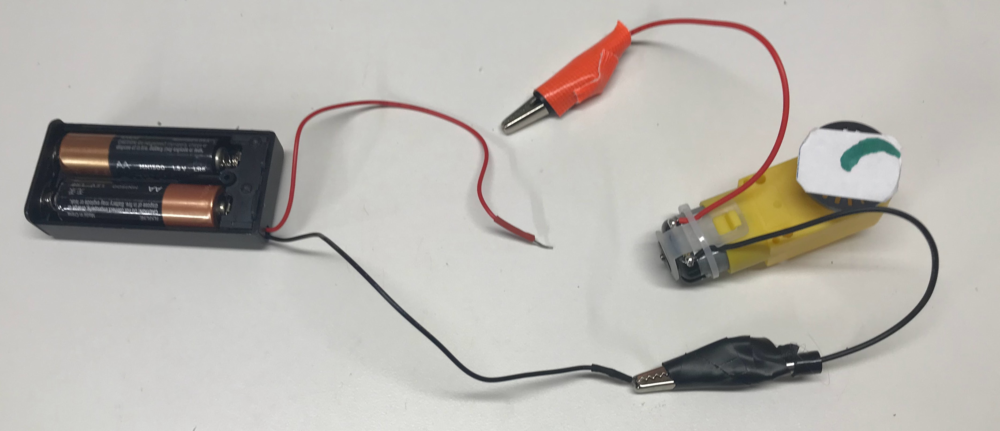

# Robot Day Motors Table

## Motor Circuit

## Sample Prompt

For the attached image, design a five-minute challenge for a 5th-grade student.  Discuss how to reverse the direction of the motor to allow a robot to move forward and backward.

## ChatGPT Response

5th Grade Science Challenge: Reversing Motor Direction

### Objective:
Understand and demonstrate how reversing the polarity of the motor leads can change the direction the motor spins.

### Materials:
- The setup in the image (battery pack, wires, and motor)
- Additional wires with alligator clips (for easy connection changes)
- A small robot or a simple structure that can move using the motor

### Challenge Instructions:
1. Observe the current setup and predict what will happen when the circuit is completed.
2. Complete the circuit by connecting the wires to the motor, and observe the direction in which the motor shaft spins. Note this as the "forward" direction.
3. Now, disconnect the wires from the motor and reverse the connections (what was on the positive terminal goes to the negative and vice versa).
4. Reconnect the wires to the motor and predict whether the direction of spin will change.
5. Complete the circuit again and observe the direction of the motor's spin.
6. Confirm if the direction is now opposite to what was observed in step 2. This is the "backward" direction.

### Discussion Questions:
- What happened when the connections on the motor were reversed?
- Why do you think reversing the wires changes the direction the motor spins?
- How could this be used in a robot to make it move forward and backward?

### Explanation:
A motor has a positive and a negative terminal. When connected to a battery, the current flows in a particular direction, causing the motor to spin in one direction. By reversing the connections, you change the flow of current, which makes the motor spin in the opposite direction. This principle is used in robotics to control movement; by reversing the polarity of the motors, a robot can be made to go forward or backward.

### Safety Note:
Always ensure that the student handles the batteries and motor under adult supervision to avoid short circuits or any potential injuries.

