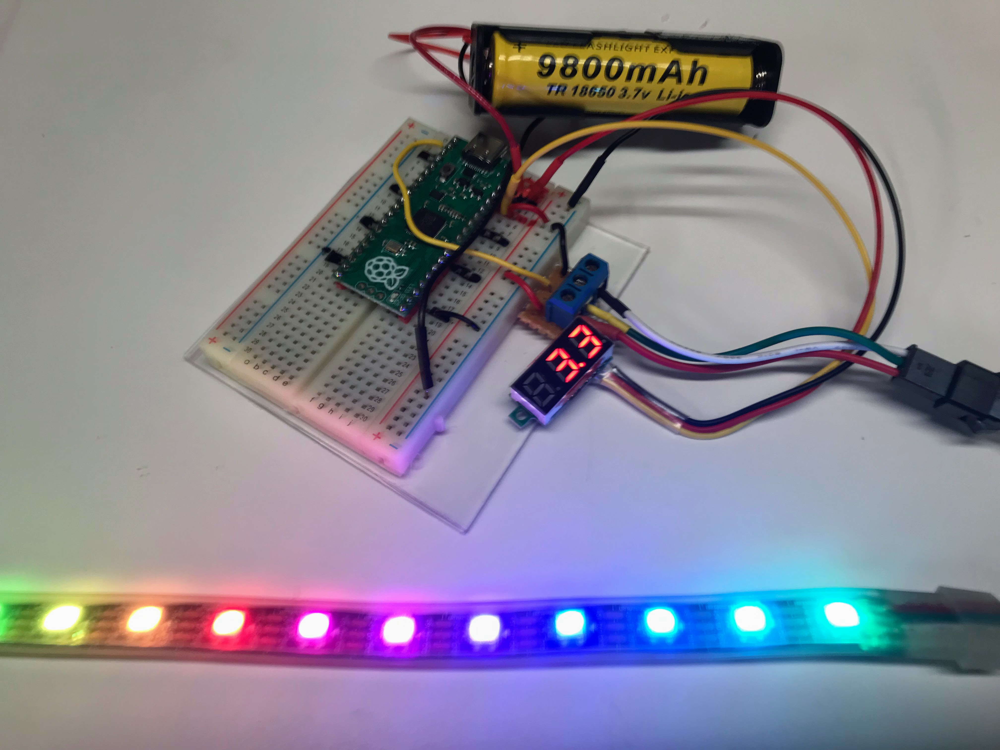

# Moving Rainbow

The [Moving Rainbow](https://dmccreary.github.io/moving-rainbow/) is the name of our labs that use a
bright and colorful LED strip to teach programming concepts.

The photo above is a 12-pixel version that is on a breadboard
with a voltage monitor and a rechargeable LoPo battery.  This
project can be used in multiple locations and can be used to:

1. See what happens when a battery is not plugged in
2. See what happens when a GND or 5V wire is removed
3. Teach the basics of a breadboard
4. Show what the voltage is coming out of the Pico 3.3V pin

You can create your own Moving Rainbow kits for about $10 a kit. Each kit includes:

1. A Raspberry Pi Microcontroller ($4)
2. A 1/2 size 400-tie solderless breadboard ($1.50)
3. A 3-terminal screw-header which is about (20 cents each)
4. An LED strip with NeoPixels ($3)

We frequently purchase these parts in bulk to get discounts.

