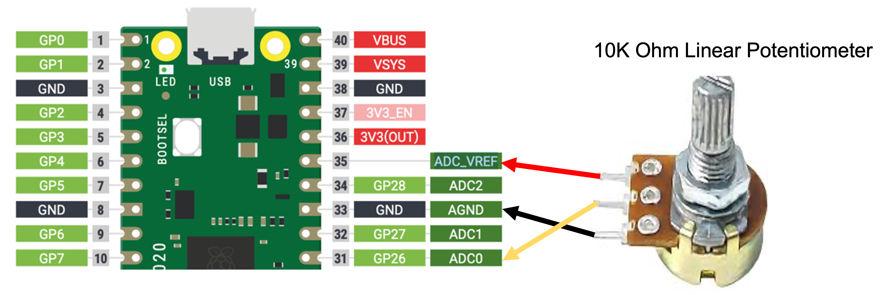

# RGB Box


This little box is one of the favorite kits of our staff.
It has a power switch and three potentiometers (pots) hooked up to a Raspberry Pi Pico.  The pots control the brightness of the red, green and blue pixels on a low-cost LED strip of about 10 pixels.  The total parts cost is around $11.  Kids as young a five years old love this project!

## Sample Dialog for a Five-Year-Old

Do you like colors?  Can you turn the red knob?
Wow!  You made it turn red?  How about the green
knob? Wow! You made it turn green! How about
the blue knob?  You are awesome!  Do you know how
to make the color purple?  Yes, you turn on both
the red and blue but keep the green off.  Cool!
I bet you might become a robot programmer someday!

## Parts List

1. Raspberry Pi Pico - $4
2. 10-element NeoPixel Strip (WS2811B) - $3
3. Breadboard - $1.50
4. 3 potentiometers - 50 cents each
5. 3 AA battery pack - $1

## Video Demo with LCD Display

This is a demo using an extra old LCD display that also
shows the red, green and blue values from 0 to 255.
Students can write down these three numbers and use
them in their programs.

<iframe width="560" height="315" src="https://www.youtube.com/embed/3Pi7bfh5pbo?si=Zux6YfCs8E6icNnH" title="YouTube video player" frameborder="0" allow="accelerometer; autoplay; clipboard-write; encrypted-media; gyroscope; picture-in-picture; web-share" allowfullscreen></iframe>

One of the challenges we give our students is the "Orange Problem".  Many colors like red, green, blue, yellow, purple and cyan are easy to create.  The values of all potentiometers are set at a minimum or maximum.  But orange is a little more challenging since it requires fine-tuning of the values or the red and green potentiometers.

## Wiring Diagram

Here is the wiring diagram for a single pot:



The difference we have is that we have three pots, one for red, one for green and one for blue.  The center taps will go
to the other analog input pins but the rails of the pots will
go to the ADC_VREF and the AGND.  Make sure you ONLY use
the AGND on pin 33 and not the other general GND pins.  The
AGND and the ADC_VREF are surrounded by special circuits to
dampen the noise so that the voltage readings don't fluctuate
with the noise on the power lines.

## Sample Code

```python
# This kit assumes we have three POTs hooked to pins 26, 27 and 28 of the Pico.
from machine import ADC, Pin
from utime import sleep
from neopixel import NeoPixel

NEOPIXEL_PIN = 0
NUMBER_PIXELS = 10
strip = NeoPixel(Pin(NEOPIXEL_PIN), NUMBER_PIXELS)

# this is the built-in LED on the Pico which we toggle on and off to show sampling
led = Pin(25, Pin.OUT)

# ADC0 is GPIO 26.  Connect to row 10 the right side
pot1 = ADC(28) # red
pot2 = ADC(27) # green
pot3 = ADC(26) # blue

MAX_DELAY = .5 # seconds

# global variables
delay = .05

# repeat forever
while True:
    # if we have the POTs wired backwards we subtract to get the value
    # read the value from the pot and shift 6 bits
    # The brightness of each LED ranges from 0 to 255 - 8 bits
    pot_value1 = pot1.read_u16() >> 8 
    pot_value2 = pot2.read_u16() >> 8
    pot_value3 = pot3.read_u16() >> 8
    print("rgb", pot_value1, pot_value2, pot_value3)
    
    # update the strip with our new values
    for i in range(NUMBER_PIXELS):
        strip[i] = (pot_value3, pot_value2, pot_value1)
    strip.write()
    
    sleep(delay)
    led.toggle()
```