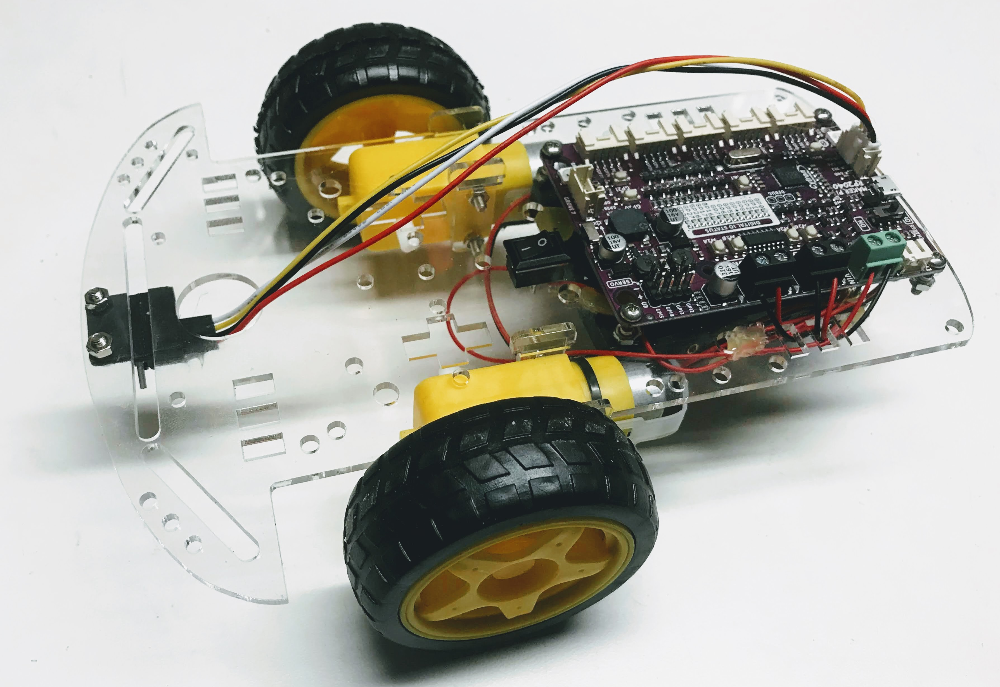

# Robot Day Robots

## Collision Avoidance



## Sample Prompt

```
The attached image is a collision avoidance robot.
It has a time-of-flight distance sensor on the front, 
two DC hobby motors, 4 AA batteries and is powered by
a Cytron Maker Pi RP2040 board.  The board has a
speaker, 14 blue LEDs, four buttons for testing the
motor connections, two NeoPixels and a port for recharging
a LiPo battery.  Assembling the robot requires no
soldering since the sensor can be hooked up using the 4-wire Grove connectors.  The distance sensor is communicating via n I2C bus.

Please write a five-minute long decription of the robot that is appropriate for a 5th-grade student.  Return the result in a single markdown file.
```
## 5th Grade Description of Collision Avoidance Robot

Hello, young inventors! Today, let's explore a cool gadget called a "Collision Avoidance Robot." This robot is like a smart car that can sense when something is in front of it and tries not to bump into it. Let's see what makes it so smart!

### What's On the Robot?

- **Time-of-Flight Distance Sensor:** This is the robot's eye. It sends out invisible signals and measures how long they take to bounce back. Just like bats use sound to "see," this sensor helps the robot know how far things are.
- **DC Hobby Motors:** These are the robot's muscles. They make the wheels turn and allow the robot to move around.
- **Batteries:** The robot needs energy to work, and it gets it from four AA batteries, just like the ones you might use in your toys or remote control.
- **Cytron Maker Pi RP2040 Board:** Think of this as the robot's brain. It's a special kind of computer that tells everything else what to do. It has cool features:
  - A speaker for making sounds.
  - 14 blue LEDs that can light up to show messages or patterns.
  - Four buttons to test if the wheels are working right.
  - Two colorful lights called NeoPixels can change colors.
  - A port to recharge a battery, so you don't always need new ones.

### Building the Robot

What's awesome about this robot is you don't need a soldering iron to put it together. Soldering is like gluing metal parts with heat, which can be tricky and hot! Instead, this robot uses something called "Grove connectors." They are like LEGO for electronics; you just plug the parts together.

### How Does It Work?
The distance sensor talks to the robot's brain using a secret language for machines called I2C (say "I squared C"). It's how the sensor tells the brain how far away things are. Then the brain decides if the robot should move forward, turn, or stop to avoid crashing.

### What Can You Do With It?
Once you build the robot, you can program its brain to do all sorts of tasks. Maybe you want it to follow a line, play a tune when it turns, or flash its lights in a pattern. It's all up to your imagination. By playing with this robot, you're learning to be a creator and an engineer!

Isn't it exciting to think about making a robot that can move all by itself without bumping into things? Who knows, maybe one day you'll make robots that can do even more amazing stuff. Keep inventing and have fun with your robot!

## Discussion for a 11-grade Student

### Prompt

```
Please repeat this for an 11th grade student.  Add the fact that it is progammed  with MicroPython.  Also return the result in a single raw mardkdown file.
```

### Collision Avoidance Robot Exploration

Hey there, future engineers and programmers! Let's dive into the mechanics and electronics of a Collision Avoidance Robot. This isn't just any toy; it's a sophisticated piece of technology that combines hardware and software to navigate its environment without crashing. Let's break down its components and understand how it operates.

### Key Components
- **Time-of-Flight (ToF) Distance Sensor:** This sensor operates on the time-of-flight principle, emitting light pulses and calculating the time they take to return after reflecting off an object. It's an advanced way to measure distance accurately and is crucial for the robot's ability to avoid obstacles.
- **DC Hobby Motors:** These motors are the driving force behind the robot's movement, allowing it to maneuver through its surroundings.
- **Power Source:** The robot runs on 4 AA batteries, providing a portable and replaceable power solution.
- **Cytron Maker Pi RP2040 Board:** This is the heart of the robot. It's a microcontroller board powered by the RP2040 chip, designed to control the robot's actions and responses. Here's what it includes:
  - A speaker for auditory feedback or alerts.
  - 14 blue LEDs that can be programmed for indicators or to display information.
  - Four buttons specifically for testing motor functions and connections.
  - Two NeoPixels, which are RGB LEDs, for a customizable visual display.
  - A charging port for a LiPo battery, offering a rechargeable power option.

### Assembly and Programming
One of the coolest features of this robot is its user-friendly assembly process. Thanks to the Grove connectors, you can put together the robot without soldering, making it accessible and safe for hobbyists.

When it comes to bringing this robot to life, MicroPython is the key. It's a lean and efficient implementation of Python 3, optimized to run on microcontrollers like the RP2040. With MicroPython, programming the robot becomes intuitive and flexible, allowing you to implement complex algorithms for navigation and obstacle avoidance.

### How It Functions
The ToF sensor communicates with the RP2040 board via the I2C bus, a robust communication protocol used in embedded systems. This allows the robot to make real-time decisions based on the distance data received from the sensor.

As an 11th grader with a grasp of programming and electronics, you can exploit the full potential of this robot. Programming it with MicroPython, you could develop algorithms for pathfinding, object tracking, and even coordinate multiple robots to work together. The possibilities are only limited by your creativity and problem-solving skills.

This project isn't just about building a robot; it's about understanding the interplay between hardware and software in robotics. It's a fantastic practical application of STEM principles that could inspire your future career path.

So, are you ready to take on the challenge and perhaps contribute to the future of autonomous robotics? Start with this robot and who knows where your skills will take you next!

