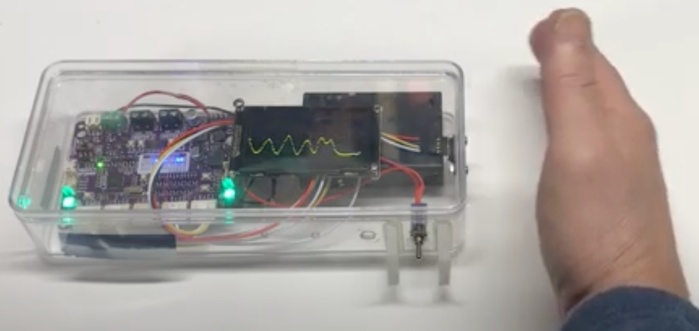

# Robot Day Time of Flight Labs

Goal: allows students to see how time-of-flight distance sensors work.

<iframe width="560" height="315" src="https://www.youtube.com/embed/e8WJgGWnEjI?si=LH0p6PbRLSh2wyUU" title="YouTube video player" frameborder="0" allow="accelerometer; autoplay; clipboard-write; encrypted-media; gyroscope; picture-in-picture; web-share" allowfullscreen></iframe>

## Sample Project Kit

## Adjustable Threshold using a Potentiometer

In this demo, we reverse the direction of a motor if the distance is within a specific threshold.  The students can adjust the threshold distance with the potentiometer.

<iframe width="560" height="315" src="https://www.youtube.com/embed/ho6Ti_M0Ucs?si=3ERv3n3KY2H5UXH8" title="YouTube video player" frameborder="0" allow="accelerometer; autoplay; clipboard-write; encrypted-media; gyroscope; picture-in-picture; web-share" allowfullscreen></iframe>

