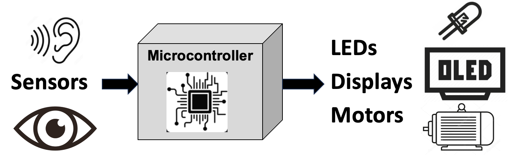

# High-Level Concepts in STEM Robotics

This page is a high-level list of some of the concepts
that we teach during Robot Days.  We continually revisit
this list to add new content and remove content that didn't
meet our standards.

We have not yet figured out how to get all these concepts
into fun, but low-cost hands-on activities.  Some of the concepts,
like battery drain, are best taught through a virtual simulation
using a [Battery Drain MicroSim](https://dmccreary.github.io/microsims/sims/battery-drain/).
It takes too long for students to watch a real battery drain down to zero.
This is a work in progress.

## Robot Parts

1. What are the key parts of a robot?
2. Where do they get their power from?
3. How do they move around?
4. How do they sense the world around them?
5. What do they use to gather signals and control their motion?

## Power Sources

1. What do power plugs like wall outlets and USB ports do?
2. What are batteries?
3. What are solar cells?
4. How do switches control the flow of power?
5. What is an open switch?
6. What is a closed switch?

## Batteries

1. What different types of batteries are there?
2. Coin cell batteries for small devices like hearing aids
3. Small lightweight LiPo rechargeable for drones
3. AA and AA
4. 9-volt batteries for smoke detectors
5. Larger LiPo rechargeable (18650)
6. Batteries have polarity - positive and negative
7. More batteries mean more power
8. Batteries have capacity ratings (milli-amp hours)
9. Batteries have voltage ratings (such as 1.5 volts, 9 volts, or 3.2 volts)

[Batteries Activity](./activities/batteries.md)

## Motors

1. What are the parts of a simple DC hobby motor?
2. How many wires are there?
3. How do you make a motor run with a battery?

### Motor Direction

1. For robots to move both forward and backward they need to be able to reverse the direction of a motor
2. How can we change the direction of a motor?

### H-Bridge

1. What are H-Bridges are circuits?
2. How can they reverse the direction of a motor by opening and closing switches?
3. How do they change the direction of current flow?
4. What if you turn on both switches on one side?

## Sensors

1. How many senses do people have?
2. If you were a robot that had to avoid crashing into a wall, what types of sensors would you use?

### Potentiometers

1. What is a potentiometer?
2. How does it work?
3. How many wires does it have?
4. What are the names of the parts?
5. How is it used?
6. Can I control a motor speed with it?

### Bump Sensors - MicroSwitches

1. What is a microswitch?
2. How would a robot use it to avoid bumping into things?
3. What action would the robot take if it bumped into an object?
4. What would be the impact of using three switches in front of a robot?

### Infrared (IR) Light Distance Sensors

1. What is an IR distance sensor?
2. How do they work?
3. Can you see the light?  If not, then why?
4. What are the different parts of an ultrasonic sensor?
5. How much do they cost?
6. How far away do they reach?
7. How sensitive are they?
8. Can they detect small objects in their field?
9. How quickly do they work?
10. Do they work in bright sunlight near a window?

### Ultrasonic Distance Sensors

1. What is an ultrasonic distance sensor?
2. How do they work?
3. Can you hear them?  If not, then why?
4. What are the different parts of an ultrasonic sensor?
5. How much do they cost?
6. How far away do they reach?
7. How sensitive are they?
8. Can they detect small objects in their field?
9. How quickly do they work?  How many times per second can they send a signal?
10. Do they work in a noisy room?
11. Do they work in the dark?

### Time of Flight Distance Sensors

1. What is a Time-of-Flight (ToF) distance sensor?
2. How do they work?
3. Can you see their light?  If not, then why?
4. Are they dangerous to the eye?
4. What are the different parts of a ToF sensor?
5. How much do they cost?
6. How far away do they reach?
7. How sensitive are they?
8. Can they detect small objects in their field?
9. How quickly do they work?  How many times per second can they send a signal?
10. Do they work in a brightly lit room?
11. Do they work in the dark?
12. Why do we love ToF sensors on our robots?

## Displays

1. What are robot displays?
2. Why are they needed?
3. What is the internal state of a robot?
4. Why would you want to observe the internal state of a robot?

### LEDs

1. What are LEDs?
2. How do they work?
3. How many wires does it have?
4. What are the parts of an LED?
5. What is the Anode and Cathode?
6. What colors do LEDs come in?
7. How much current do they use?
8. Can you burn out LEDs?
9. How much do they cost?
10. What is a current-limiting resistor?

Tip: tell the story of the tall girl with red hair named Ann.  She has a small black cat at her feet.  The long pin is the positive Annode!

### RGB LEDs

1. What is an RGP LED?
2. How many wires does it have?
3. What are the basic colors?
4. Can you mix the colors?

### NeoPixels

1. What is an NeoPixel?
2. Why do kids love them?
3. How many wires do they have?
4. What is name of each wire?
5. Can they be connected together?
6. How much current does each NeoPixel draw?
7. How do you program them?
8. How much do they cost?

### NeoPixel Strips, Rings and Matrix

1. What is a NeoPixel strip?
2. What is a NeoPixel ring?
3. How do you program them?
4. How much do they cost?
5. What are the spacing options?
6. What are the waterproofing options?

### OLED Displays

1. What is an OLED display?
2. Why are they so nice?
3. What sizes do they come in?
4. How much do they cost?
5. How do you program them?
6. How many wires do they have?
7. What colors do they come in?
8. Can we use them with our robots?

## Microcontrollers

1. What are microcontrollers?
2. Are they like the brain of a robot?
3. What are the different types?
4. How much do they cost?
5. How much memory do they have?
6. How fast do they run?
7. How do you program them?

### Older Arduino Microcontrollers

1. Why are they no longer popular?
2. Why do kids like Python?
3. Why does Python not run on an Arduino?

### Raspberry Pi Pico

1. Low cost - $4
2. Lots of memory

### Raspberry Pi Pico W

1. Added wireless operation

### Cytron Maker Pi RP2040

1. Integrated chips to control motors

## Collision Avoidance Robots

1. What is a collision avoidance robot?
2. What are the parts?
3. How do they work?
4. How do you program them?
5. What are the parameters?
6. How do you tune them?
