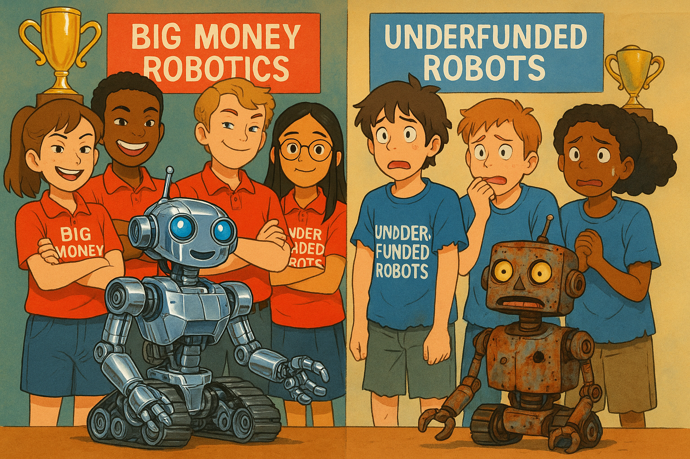

# Why Exploration over Competition

<!--
Create an image of two junior-high students teams at a competitive robotics event.
Each team has one robot and four students of mixed race and gender.

The team on the left is called "Big Money Robotics".  Their fancy polo shirts are bright red.  It has ultramodern high-tech, shiny chrome and very expensive intimidating robot.  They have big trophies in the background. The team is very proud of their robot and full of gloating faces.  They are very confident they will win.

The team on the right side is called "Underfunded Robots".  Their old t-shirts worn t-shirts are blue. They have a very old rusty robot that is falling apart.  The team members are full of anxiety and they look fearful.

Use a studio Ghibli-style rendering but use bright colors and colorful style.

Make both groups have one robot and four students.  The students are of mixed race and gender.

-->

## Why Competitive STEM Events Can Be Problematic

Competitive STEM events, while valuable in many ways, can create several barriers to participation:

### 1. Emphasis on winning over learning

- When the focus is primarily on competition, students who are still developing skills may feel discouraged
- The pressure to win can overshadow the joy of discovery and experimentation

### 2. Access inequality

- Schools and communities with more resources can provide better equipment, mentorship, and preparation
- Students from under-resourced schools start at a disadvantage

### 3. Gender and cultural biases

-   Traditional competitive formats may inadvertently favor communication and collaboration styles more common among certain demographics
-   Historically male-dominated STEM fields can create environments where girls and non-binary students feel unwelcome

### 4. Fixed mindset reinforcement

- Competition can reinforce the idea that STEM ability is innate rather than developed
- Students who don't succeed immediately may conclude they "aren't good at STEM"

### 5. Anxiety and stress

- High-pressure competitive environments can trigger performance anxiety
- This particularly affects students who might already feel they don't belong in STEM

## Robot Day: An Alternative Approach

The Robot Day format described in this website offers a promising alternative model by:

- Creating an exploration-based format rather than a competition
- Focusing on hands-on experiences with different components
- Emphasizing understanding over performance
- Providing a structured but self-paced experience

This type of approach tends to be more inclusive and can attract a more diverse group of participants while still generating enthusiasm for STEM concepts.

## Research Findings

There are many concerns about competitive STEM events and their potential drawbacks.  There is ample research that supports the concerns about competitive STEM events and their potential negative effects on inclusivity and participation. Here are the key research-backed findings:

### Competition vs. Collaboration Research

Research indicates that students have a qualitatively better experience when working collaboratively rather than competitively. In fact, in a meta-analysis comparing cooperative versus competitive student interactions on problem-solving tasks, the cooperative groups consistently outperformed individuals across all forms of problem-solving.

When STEM classroom activities are structured as competitions designed to make learning "fun" rather than meaningful, they can generate significant drawbacks including "increased anxiety and lower academic performance."

### Institutional Factors

According to research by [Lorelle Espinosa](https://sloan.org/about/staff/lorelle-espinosa) at the Sloan Foundation, many colleges (particularly "predominantly White, large public research institutions") perpetuate learning environments characterized by "impersonal, large classrooms; unapproachable professors; and competitive grading practices resultant from a system that actively attempts to 'weed' students out of STEM majors."

[McGee (2020)](https://www.researchgate.net/publication/347535853_Interrogating_Structural_Racism_in_STEM_Higher_Education) suggests that many "Eurocentric" STEM departments sustain a culture of "meritocracy," "unrelenting competition," and other factors that can disproportionately disadvantage students from underrepresented groups.

### Inequitable Access

Studies show inequality in access to STEM courses at the earliest stages of K-12 education, which exacerbates broader nationwide issues in pay discrepancy.

When educational systems reward demonstrated excellence over funding equitable opportunities for hands-on, dynamic STEM lessons and activities, the system produces fewer students overall who are prepared to meet the rigors of the 21st-century workplace.

### Alternative Approaches

The research also points to effective alternatives to competitive models:

Promoting peer networking opportunities can enhance feelings of belongingness, which is an essential aspect of inclusive STEM education. Collaboration and teamwork among students from diverse backgrounds helps ensure all have an equal chance to participate and contribute.

The National Science Foundation's INCLUDES initiative emphasizes that rather than building isolated programs focused on particular groups, creating networks and collaborative infrastructure gives the scientific community a new approach that centers on working together to implement multiple research-supported strategies at scale.

Singapore, which consistently tops the charts in PISA rankings for math, reading and science, also ranks first in collaborative problem-solving, suggesting that their emphasis on collaboration and shared learning (as opposed to winner-takes-all competition) contributes to their educational success.

The Robot Day format aligns well with these research findings by focusing on exploration and hands-on learning rather than competition, creating a more inclusive environment that encourages participation from a diverse range of students.

## The Case for Appealing Sparingly to the Competitive Urge in STEM Education

Competition has long been a default strategy for engaging students in STEM learning. From science fairs to robotics contests, we've traditionally incentivized participation through the promise of winning. While some competitive elements can spark interest, the research increasingly suggests that educators should "appeal sparingly to the competitive urge" when designing STEM events. This approach isn't about eliminating competition entirely, but rather being intentional and judicious in its application.

### Competition Creates Unintended Barriers

When STEM activities become primarily about winning, we inadvertently create environments that favor certain students while alienating others. This competitive framework can trigger increased anxiety and even lower academic performance in many participants. Rather than inspiring all students, competition-heavy environments often reinforce existing disparities in confidence and perceived ability.

Particularly concerning is how competitive frameworks disproportionately affect students from underrepresented groups in STEM. Students who don't see themselves reflected in the field already battle against stereotype threat - the added pressure of competitive evaluation can further magnify these psychological barriers.

### Collaboration Outperforms Competition in Learning Outcomes

Research comparing cooperative versus competitive student interactions demonstrates that cooperative groups consistently outperform competitive individuals across all forms of problem-solving. This suggests that our emphasis on competition may actually be counterproductive to our fundamental learning objectives.

Singapore, which consistently leads global PISA rankings in math, reading, and science, also ranks first in collaborative problem-solving. Their educational approach emphasizes collaboration and shared learning rather than winner-takes-all competition, suggesting a correlation between collaborative educational models and educational success.

### The Equitable Alternative

The evidence strongly suggests that STEM education is most effective when it:

1.  **Emphasizes collaboration over competition** - Creating opportunities for students to work together toward shared goals
2.  **Focuses on process rather than product** - Rewarding innovative thinking and persistence rather than just successful outcomes
3.  **Creates inclusive learning environments** - Ensuring all students feel they belong and can contribute
4.  **Uses competition strategically and sparingly** - Introducing competitive elements that enhance rather than dominate the learning experience

When competitive elements are included, they should be carefully designed to:

-   Focus on personal improvement rather than outperforming peers
-   Ensure equal access to resources and preparation
-   Emphasize team-based rather than individual competition
-   Reward multiple forms of excellence, not just a single winner

## Conclusion

The question isn't whether competition has a place in STEM education --- it's about finding the right balance. By appealing sparingly to the competitive urge, educators can harness its motivational benefits while minimizing its exclusionary effects. This balanced approach creates STEM learning environments that are not only more equitable but also more effective at developing the collaborative problem-solving skills today's students will need in tomorrow's workforce.

The goal should be to design STEM experiences that inspire all students to engage deeply with content, develop resilience in the face of challenges, and see themselves as capable contributors to scientific discovery. By thoughtfully limiting competitive elements, we create spaces where a diverse range of students can thrive, ultimately strengthening the STEM pipeline and enriching the field with varied perspectives and approaches.

## References

1.  [Competition versus collaboration in STEM education | Silicon Republic](https://www.siliconrepublic.com/careers/collaboration-stem-education) 2 Jan 2018

2.  [Inclusion in practice: a systematic review of diversity-focused STEM programming in the United States | International Journal of STEM Education](https://stemeducationjournal.springeropen.com/articles/10.1186/s40594-022-00387-3) - 06 January 2023 - Palid, O., Cashdollar, S., Deangelo, S. et al. IJ STEM Ed 10, 2.

3.  [Fostering Inclusivity in STEM Teaching: Tips and Best Practices | Plantae](https://plantae.org/fostering-inclusivity-in-stem-teaching-tips-and-best-practices/)

4.  [The U.S. Should Strengthen STEM Education to Remain Globally Competitive | CSIS](https://www.csis.org/blogs/perspectives-innovation/us-should-strengthen-stem-education-remain-globally-competitive)

5.  [INCLUDES: Making a collective impact to broaden participation in STEM | NSF](https://www.nsf.gov/science-matters/includes-making-collective-impact-broaden)

6.  [Creating inclusive classrooms by engaging STEM faculty in culturally responsive teaching workshops | International Journal of STEM Education](https://stemeducationjournal.springeropen.com/articles/10.1186/s40594-020-00230-7)