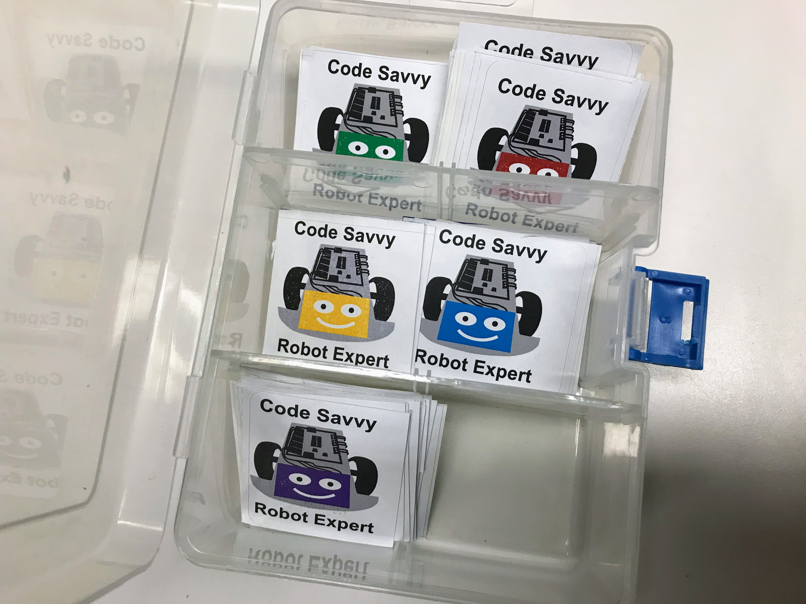

# Glossary of Terms for Robot Day

#### Checklist

A checklist of items that students need to complete to earn their robot expert badge.

#### Robot Corral

A region of the Robot Day floor space that is dedicated to allowing the collision avoidance robots to run free.  The corral is typically about six feet in diameter and the wall height is about six inches.  The corral fence is usually made of cardboard that can be quickly folded up.  Some corrals have "NASCAR" type signage that references the sponsors of your local Robot Day event.

#### Robot Expert Badge

Small badges are given to students who complete their checklist of activities.
We provide a variety of PowerPoint templates you can customize to add
your school name or event name to the badge.  Badges can be printed on
mailing address labels and cut up into squares.

