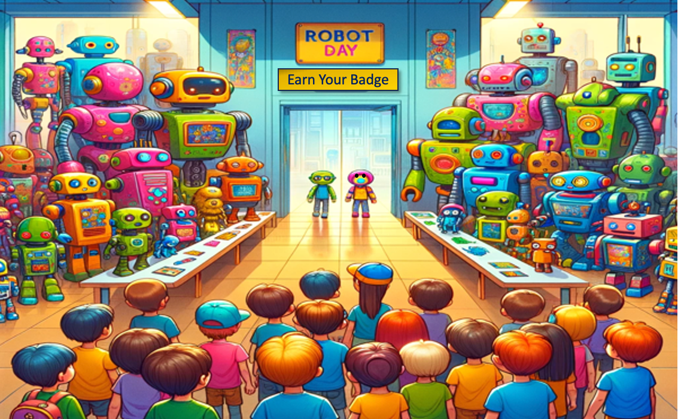

# Welcome to Robot Day!

Welcome to the Robot Day website.  This website contains resources
to help your organization host a fun kid-friendly Robot Day
for your community.  These events are hosted by science museums, schools, libraries, coding clubs, science clubs, scouting troops, robotics teams, and community centers.  The events promote fun learning about STEM concepts for kids ages 5 to 18.

We have been testing these events for almost five years, and we think
we have some thoughtfully designed and tested activities that are fun and cost-effective to promote inclusion by organizations with modest budgets of just a few hundred dollars.

In 2023 we have also started integrating generative AI into our
content.  We have provided tools to help you quickle customize our
content and generate [MicroSims](./glossary.md#microsim) that
mirror our hands-on activities.

Please let me know if you have any feedback!

[Dan McCreary on LinkedIn](https://www.linkedin.com/in/danmccreary/)

