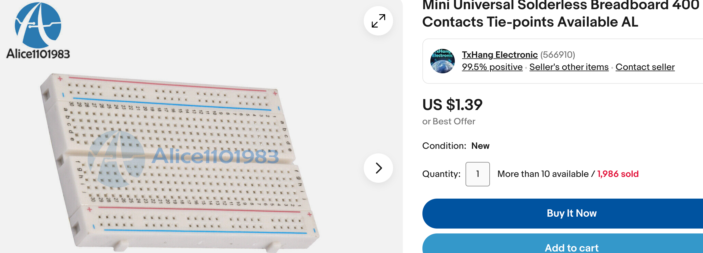
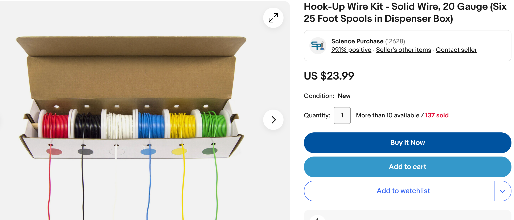
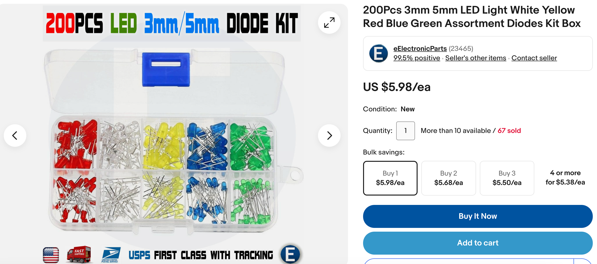
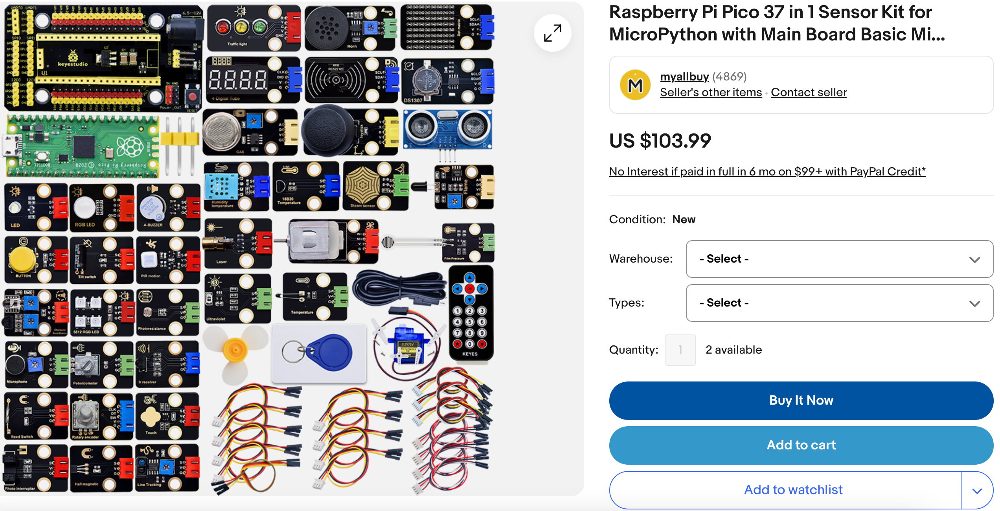
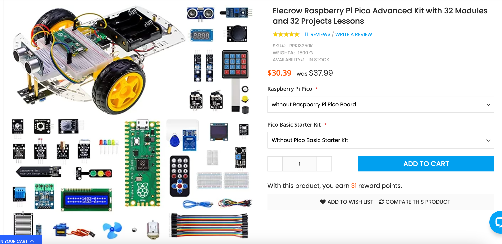
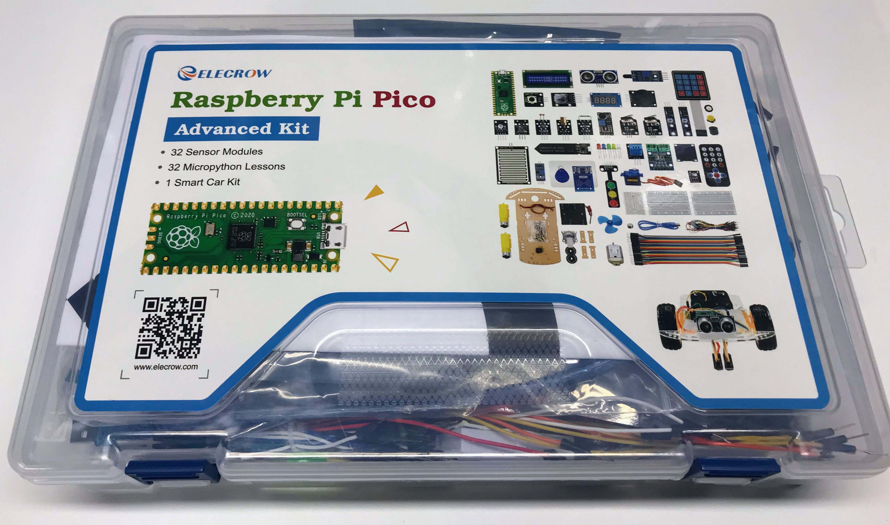
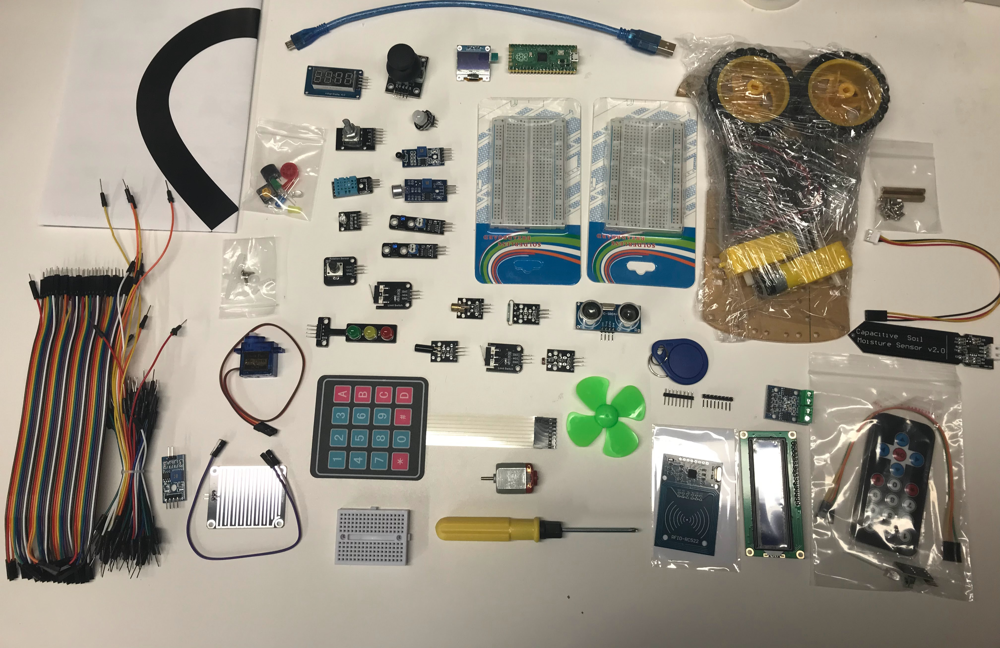

# Purchasing Parts and Kits for Robot Day

Let's be honest here.  Finding low-cost robotics kits that focus
on teaching computational thinking is hard.  Retailers focus
on families with high disposable incomes that are not sensitive
to price.  Retailers like Amazon frequently take 30% margins
and robot parts suppliers are forced to pay their fees and
use their warehouses.  Amazon uses every opportunity to use AI to keep its profit margins high.  That puts the burden on teachers and 
event organizers to be clever and find the best value for your organization.

As one example, let's take the "2WD Smart Robot Car Chassis" problem.

Here are some identical items:

The price for the chassis alone varies from $3.80 to $95!  You can find
similar items by searching for "2WD Smart Robot Car Chassis".

The first item is probably priced by an AI agent that is a little out of touch with reality.  The second from the retailer 
[BOTs and four DOTs](https://www.amazon.com/2WD-Smart-Robot-Car-Chassis/dp/B0C4TPVH8H/ref=sr_1_6) is a lot more reasonable. But the [Cytron](https://www.cytron.io/p-2wd-smart-robot-car-chassis) listing clearly not only
has a lower price, but the price goes down if you order multiple items.

If you don't have worries about budgets, the vendor [SparkFun](http://sparkfun.com) sells high-quality parts and you can filter by which robots support MicroPython like [Kitronik Autonomous Robotics Platform for Pico](https://www.sparkfun.com/products/19520).  This kit is nice, but does not support room
for a breadboard on top like the standard Smart Car Chassis.

## Avoid Older Arduino Microcontrollers

With the incredible growth of the new Raspberry Pi Pico and RP2040 parts, there is still a flood of older Arduino robot kits on the market.  These kits
are severely limited but lack of RAM (2K comparted to the Pico's 264K)
and are not breadboard-friendly.  I would strongly suggest avoiding these kids.

## Suggested Parts

1. Raspberry Pi Pico - Just $4 at MicroCenter
2. Breadboard - 1/2 size is fine
3. 2WD Smart Robot Car Chassis - includes motors and battery pack
4. Motor Controller or Cytron Maker Pi RP2040
5. Distance sensor (time of flight sensor preferred)
6. Wires
7. Batteries

## Breadboards, Wire, LEDs and Sensors

You can also purchase bulk breadboards, LEDs, wire, and sensor packages for your robotics day events.

### Breadboards

We like to use the 400-tie breadboards.  We use hot-glue to keep the pins from slipping out when kids are using them.  You can find them on [EBay for $1.50 each](https://www.ebay.com/itm/311737682581)

### Hookup Wire

Multi colored solid-core [hookup wire](https://www.ebay.com/itm/122171182561):

### LEDs

Here is an example of a kit of 200 LEDs for $6:

### Sensor Kit

Rather than purchase individual sensors, you can get
a kit that contains 37 sensors.  These can be connected using
Female-to-Female Dupont connectors with no soldering required.

[Raspberry Pi Pico 37 in 1 Sensor Kit](https://www.ebay.com/itm/145511286666)

## Cytron Maker Pi RP2040

This is our favorite robotics board by far.  It is well-designed with many
features that make it easy for the students to test their motors
and connections.

[MAKER-PI-RP2040 at Digikey](https://www.digikey.com/en/products/detail/cytron-technologies-sdn-bhd/MAKER-PI-RP2040/14557836) - great value for $11

[The Cytron Maker Pi RP2040 Robotics Board](https://dmccreary.medium.com/the-cytron-maker-pi-rp2040-robotics-board-b1dc7f0eab34)

## Elecrow Raspberry Pi Pico Advanced Kit

At $31, the [Elecrow Raspberry Pi Pico Advanced Kit](https://www.elecrow.com/raspberry-pi-pico-advanced-kit-with-pico-board-32-modules-and-32-detailed-projects-lessons.html) is an excellent value.

## Sparkfun

[Kitronik Autonomous Robotics Platform for Pico](https://www.sparkfun.com/products/19520)

## SunFounder Raspberry Pi Pico Robot Kit

Although this kit uses 4 motors (not the usual 2), and it uses
the older ultrasonic distance sensor, at $71 it still has some
good value.  Note that the LiPo batteries are included.

[Raspberry Pi Pico Smart Car Kit ](https://www.sunfounder.com/products/raspberrypi-pico-car)