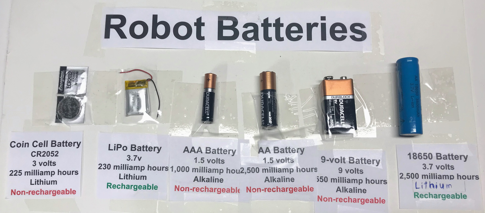

# Batteries Discussion for 11th Grade Robotics Course

**Page Title: Understanding Battery Technology for Robotics**

**[Image Caption]: Comparative Analysis of Battery Types in Robotic Applications**

**Greetings, Future Engineers!**

In the realm of robotics, power sources are critical. Our exploration today delves into the types of batteries showcased here, each with unique characteristics and applications within robotic systems.

First in our lineup is the **Coin Cell Battery** (CR2052). This compact power source offers a voltage of 3V and a capacity of 225 milliamp hours (mAh). Its small form factor is ideal for low-power applications such as CMOS batteries in computers or in micro-controllers for tiny robotic mechanisms.

Moving on, we have the **LiPo Battery**. This 3.7V rechargeable battery is a powerhouse in energy density, offering 230 mAh. Its flexible form factor and high discharge rates make it indispensable for mobile robotics, where weight and space are at a premium.

We also encounter the ubiquitous **AAA and AA Batteries**. With a standard voltage of 1.5V and capacities ranging up to 2,500 mAh, these alkaline cells are the go-to for prototyping and powering smaller robotic components that require a reliable, albeit lower, current draw.

The **9-volt Battery** is next, known for its distinct rectangular shape and snap connectors. Offering 9V and 550 mAh, this battery is commonly used in backup power supplies for safety mechanisms within robotics, like emergency stop systems.

Lastly, we have the **18650 Battery**, a lithium-ion cell with a substantial capacity of 2,500 mAh at 3.7V. This rechargeable battery is a workhorse in robotics for its balance of high energy density and longevity, suitable for larger robots or those requiring extended operational periods.

**Key Points for Roboticists:**
- Voltage (V) is akin to the potential energy driving the electric current, necessary for powering motors and sensors.
- Capacity (mAh) indicates the total charge a battery can hold, determining the duration your robotic system can operate before requiring a recharge.
- Rechargeability offers sustainability and cost-effectiveness for long-term projects.

As we navigate the intricacies of robotic design, selecting the appropriate battery type is paramount. It's not just about the power—a battery's size, weight, voltage, capacity, and discharge rate must align with the specific needs of our robotic application.

**In Conclusion:**
- The **Coin Cell** is for minimal power requirements in compact spaces.
- **LiPo** provides high energy density for weight-sensitive applications.
- **AAA and AA** are standard for prototyping and low-power components.
- **9-volt** offers a higher voltage for critical backup systems.
- **18650** is the choice for high-capacity, rechargeable solutions in larger robots.

In the evolution of robotics, mastering the use of various batteries will enhance both the efficiency and functionality of your creations. Remember to consider environmental implications and recycle used batteries responsibly.

**Continue Innovating, Continue Advancing!**