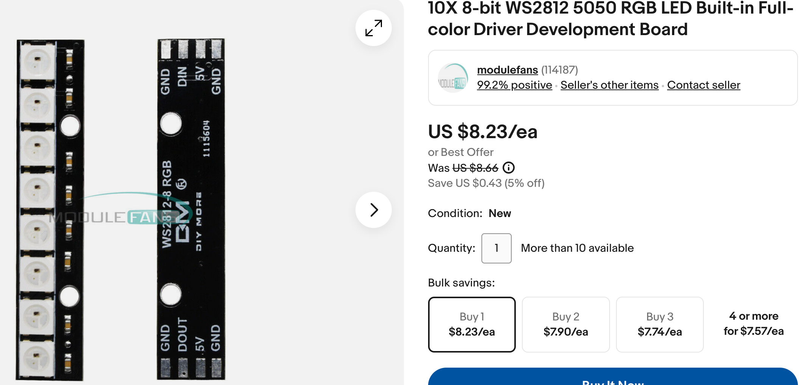

# NeoPixel Stick Lesson Plans with MicroPython

NeoPixels are VERY popular in all of our classes.  We have
an entire site dedicated to teaching computational thinking
using LED strips called our [Moving Rainbow Project](https://dmccreary.github.io/moving-rainbow/).



We have found ways to purchase 8-pixel strips for under a dollar each.  They are also available at Sparkfun and Adafruit for $6 each.

## Sample Prompt

```linenums="0"
We just purchased 30 of these 8-pixel Neopixel Sticks for use in our 9th grade robotics classrooms.  Our students all have experience with introduction to MicroPython.  Can you suggest some lesson plans that use these devices. 
```

## Sample Response

### 1. Introduction to Digital Electronics and RGB LEDs
#### Objective
Understand how RGB LEDs work and how they can be controlled with digital signals.

#### Activities
- Basic circuitry: Set up the Neopixel Stick with a microcontroller and a breadboard.
- Programming LEDs: Light up the LEDs using MicroPython.
- Experiment with colors: Create custom colors by mixing different intensities of red, green, and blue.

### 2. Programming Loops and Patterns
#### Objective
Learn how to create loops and control flow in MicroPython to generate patterns.

#### Activities
- Design and implement a simple pattern using loops.
- Create a "Knight Rider" scanner effect.
- Discuss the effects of changing loop variables on patterns.

### 3. Data Representation and Visualization
#### Objective
Demonstrate how data can be represented visually using LEDs.

#### Activities
- Display battery level or signal strength with LEDs (bar graph).
- Create a simple equalizer for volume levels if a sound sensor is available.

### 4. Introduction to Communication Protocols
### Objective
Understand the basics of serial communication and how data is transmitted to LEDs.

#### Activities
- Explain serial communication and the Neopixel Stick's use of it.
- Send a byte of data to control the color of an LED.

### 5. User Input and Interactivity
#### Objective
Integrate user input to control the LEDs.

#### Activities
- Program LEDs to respond to buttons or sensors.
- Create interactive games like a reaction timer.

### 6. Function and Modular Coding
#### Objective
Learn about creating reusable code blocks (functions).

#### Activities
- Refactor pattern code into functions.
- Build custom functions for lighting effects.

## 7. Synchronization and Timing
### Objective
Explore the concept of timing and delays in programming.

### Activities
- Create LED animations with timing.
- Investigate the impact of delays on animation.

### 8. Art and Design with Technology
#### Objective
Encourage creativity by integrating art and design with LED programming.

#### Activities
- Collaborative art project with LEDs representing pixels.
- Program sticks to change color in response to music or stimuli.

Remember to balance theory with hands-on activities and encourage experimentation.
