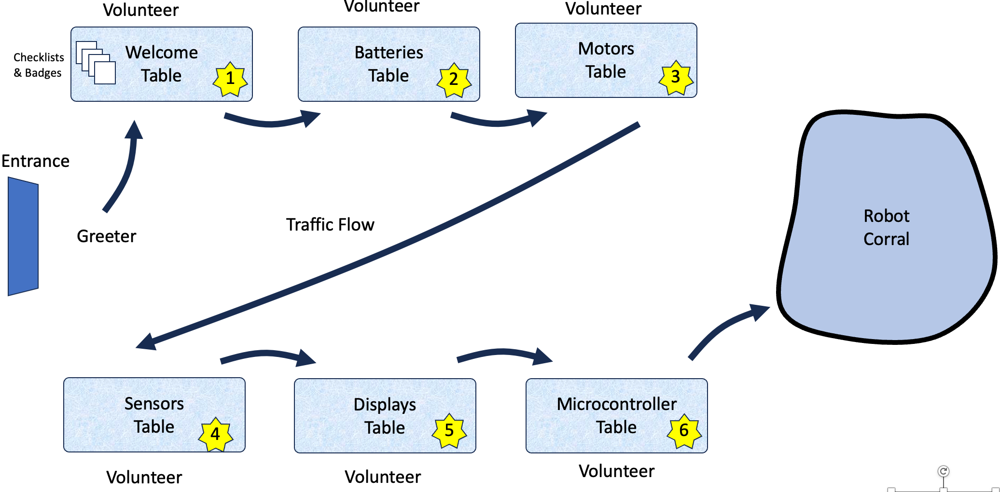

# Robot Day Process

<!--
Copy and paste this code into Mermaid Live Editor at http://mermaid.live

ChatGPT prompt:

Create a process flow diagram in mermaid format that describes the following steps:

1. Greeter
2. Checkin
3. Table Activities
4. Get Badge
5. Assessment

Note that I had to remove the -- in the arrows because that conflicted with the end HTML comment

graph LR
    A[Greeter] -> B[Checkin]
    B -> C[Table Activities]
    C -> D[Get Badge]
    D -> E[Assessment]
-->

## Sample Greeting Dialog

The greeter is our most important role.  Their job is to make
everyone feel welcome and get excited about learning about robots.
Greeters need to have a strong awareness of a student's mood and
anxiety levels.

**Greeter:** *Do you like robots? Yes? Would you like to take our robot challenge and earn this cool robot badge? Yes? Cool!*

!!! Note
    If the student looks apprehensive you can just suggest they look around
    and let the greeter know if they want to take the challenge later.

Next Step: Greeter brings the student over to the registration table]

## Checking In

**Welcome Table Volunteer:** *Write your name at the top of this form.  If you visit all
six tables you will get this cool badge!  You can start
at the Batteries table here!*

## Table Activities

A typical list of tables for a large 24'x36' foot room will have the following tables:

1. Welcome and Checkin Table
2. [Batteries Table](./activities/batteries.md)
3. [Motors Table](./activities/motors.md)
4. [Sensors Table](./activities/sensors.md)
5. [Displays Table](./activities/displays.md)
5. [MicroControllers Table](./activities/microcontrollers.md)

Which leads to the [Robot Corral](./glossary.md#robot-corral)

## Get Badge

Can I see your slip?

Wow!  I see you completed all the tasks!  Congratulations!!

Here is a collection of badges.  

You can pick any color you like.

TODO: Add pick as a color.

## Assessment

We just ask a few questions

Kids:

1. Did you have a good time?
2. What was your favorite part?

Parents:

1. Do you have any questions on how kids can learn more about robots
and STEM?

