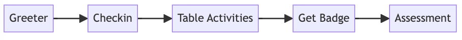

# Robot Day Process

<!--
Copy and paste this code into Mermaid Live Editor at http://mermaid.live

ChatGPT prompt:

Create a process flow diagram in mermaid format that describes the following steps:

1. Greeter
2. Checkin
3. Table Activities
4. Get Badge
5. Assessment

Note that I had to remove the -- in the arrows because that conflicted with the end HTML comment

graph LR
    A[Greeter] -> B[Checkin]
    B -> C[Table Activities]
    C -> D[Get Badge]
    D -> E[Assessment]
-->

()

## Greeter

Do you like robots?

Would you like to take our robot challenge?

## Checkin

Write your name at the top of this form.  If you visit all
six tables you will get this cool badge!

## Table Activities

## Get Badge

Can I see your slip?

Wow!  I see you completed all the tasks!  Congratulations!!

Here is a collection of badges.  You can pick any color you like.

TODO: Add pick as a color.

## Assessment

Did you have a good time?

What was your favorite part?

