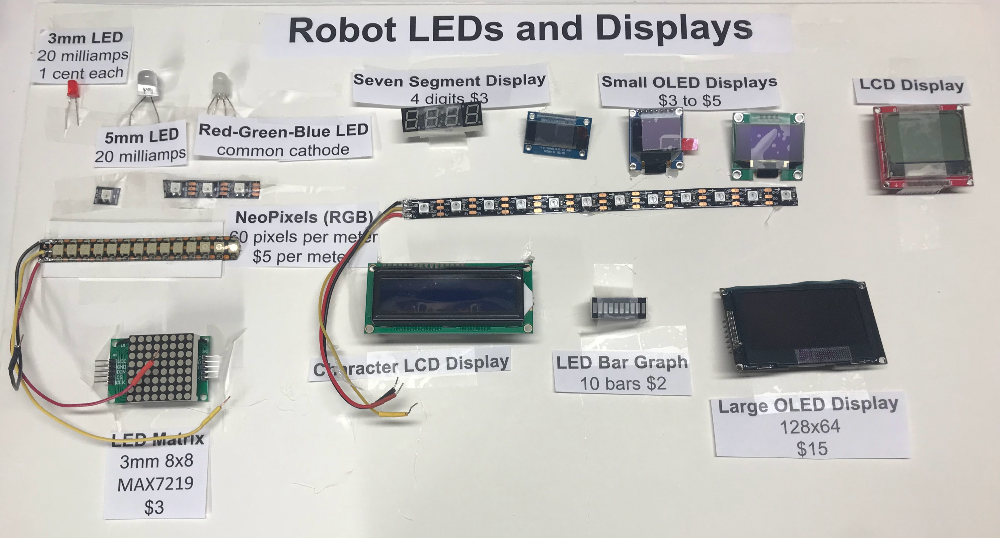

# Displays

!!! prompt "Prompt Text"
    Above is an image of a poster board we are using
    in our Robot Day event.  There are many different
    types of displays with different sizes and costs.

    Please generate a sample five minute dialog between
    a teacher-volunteer-mentor and a student.  Discuss
    the different types of displays and their costs.
    Talk about the tradeoffs of low-cost simple displays
    and the more complex graphic displays.  Mention
    that the faces on our robots use the larger
    128x64 OLED displays.  Also mention how bright
    and high contrast they are so you can see them
    even when the robots are on the floor and we are standing up.

    Also mention that the table now has the new 240x240
    circular smart watch displays and color OLEDs.

## Sample Response

**Teacher:** Hi there! I see you're checking out our "Robot LEDs and Displays" board. See all these different screens and lights? Each type can show information in a unique way.

**Student:** Whoa, there are so many! I see small LEDs, a bar graph, some weird strips of lights, and bigger screens. What's the difference between all of them?

**Teacher:** Great question. Let's start simple. These tiny LEDs---like the little red one here---are really cheap. They're just a few cents each. They can only show on or off, and sometimes a few colors if it's an RGB LED. But they don't show numbers or letters by themselves; we have to arrange them in patterns.

**Student:** So they're cheap, but not very "smart," right?

**Teacher:** Exactly. Then we have something like this seven-segment display. It's about $3, and it can show numbers by lighting up certain segments. This is how old-school digital clocks show the time. It's still pretty simple and affordable, but more useful than a single LED because you can display digits.

**Student:** Okay, so that's a step up. What about these small OLED displays?

**Teacher:** These small OLEDs can cost around $3 to $5. They let you display not just numbers, but also text and simple graphics. They're higher in cost than simple LEDs or seven-segment displays, but they're a lot more flexible. You can draw shapes, show images, and even little animations if you want.

**Student:** That's cool. And what about these bigger ones?

**Teacher:** This larger OLED display here is 128x64 pixels, and it costs about $15. More pixels means higher resolution and the ability to show much more detail---like little robot faces! In fact, our robots use these larger 128x64 OLEDs for their faces. They're bright, high-contrast, and you can easily see them even if the robot is down on the floor and you're standing up. That brightness and clarity are really helpful in a classroom setting, so everyone can see the robot's expression.

**Student:** So more detail means more cost?

**Teacher:** Generally, yes. More complex displays with better resolution cost more. But they allow you to do much more creative things, like showing a smiley face, animations, sensor readings, or even tiny games. It's a tradeoff: simpler displays are cheaper and easier to use, while more complex displays are more expensive but can show a lot more information.

**Student:** That makes sense. I see something about "NeoPixels" and "RGB" strips. What's that?

**Teacher:** NeoPixels are addressable RGB LEDs. You can control each LED's color individually. They're about $5 per meter and can create all kinds of patterns and effects, like rainbow chases and blinking sequences. They're great for adding colorful flair to a robot or project.

**Student:** And these displays that look like little smartwatches?

**Teacher:** Ah, those are the new 240x240 circular displays, like what you'd find in a smartwatch. They're higher resolution and often in color, making them more expensive and a bit more complicated to program. We also have color OLEDs, which are beautiful but cost more and need more programming skills to handle the graphics and color data.

**Student:** So if I just need something simple, I go for a seven-segment or a basic LED. If I want color and fancy graphics, I can use a color OLED or a smartwatch-style display, but it's going to cost more and be harder to code?

**Teacher:** You've got it. Choosing a display is all about balancing cost, complexity, and what you need it to show. For our $19 collision avoidance robots, we liked the 128x64 OLED because it's a good balance. It's bright, easy to read, and flexible enough to show faces and messages, but not as expensive or complicated as a full-color display.

**Student:** That makes sense. So as I get better at programming and I have a bigger budget, I can upgrade to fancier displays.

**Teacher:** Exactly. Start simple, and as your skills and project requirements grow, you can move up to more advanced displays. It's all about learning step by step.