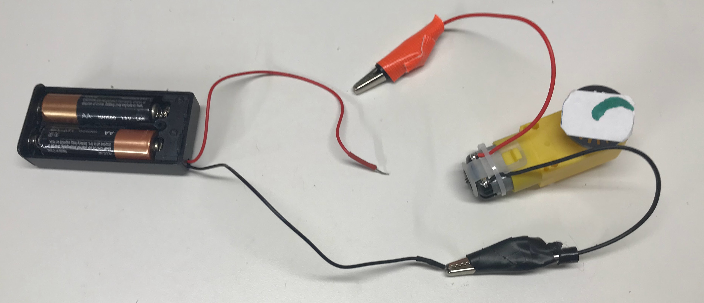

# Motor Circuit



```linenums="0"
The image above shows a battery
pack with two AA batteries and some
jumper wires connected to a small DC
hobby motor that is connected to a 40-to-1
gear reduction assembly for driving a
wheel on a robot.  Please generate a sample
dialog between a teacher/volunteer/mentor and
a student about this circuit.  Describe
how the polarity can be reversed to change
the direction of a motor.
```

## Sample 5-Year Old Dialog

**Teacher:** Hi there! I see you're curious about this setup. We have a simple circuit here with a battery pack, some wires, and a small DC motor connected to a gear assembly. What do you think is happening when we connect the batteries to the motor?

**Student:** It looks like the batteries give the motor power so it can spin. Is that right?

**Teacher:** Exactly! The two AA batteries in the pack provide electricity---this electricity flows through the wires into the motor. The motor then spins the gear attached to it, and that gear can turn a wheel on a robot.

**Student:** So the motor turns the wheel, and that makes the robot move?

**Teacher:** That's right. The gear reduction makes the motor spin more slowly, but with more force, so it can move a wheel. Without the gears, the motor might spin too fast and not have enough torque to move a heavier wheel effectively.

**Student:** I've heard something about polarity before. How does that matter here?

**Teacher:** Good question. Each battery has two ends: a positive end and a negative end. When you connect the positive end of the battery to the motor's positive terminal, and the negative end of the battery to the motor's negative terminal, the motor spins in one direction.

**Student:** What if I switch the wires around?

**Teacher:** If you reverse the polarity---meaning you flip which wire is connected to positive and which is connected to negative---the motor will spin in the opposite direction. So if it was spinning clockwise before, now it would spin counterclockwise.

**Student:** That's really cool. So just by swapping the red and black wires, I can make the motor go backward?

**Teacher:** Exactly. Red is usually connected to the positive battery terminal, and black to the negative, which makes the motor spin one way. If you reverse them---black on the battery's positive terminal and red on the negative terminal---the motor's direction changes.

**Student:** So this can control which way the robot's wheels turn?

**Teacher:** Yes. By changing polarity, you control the direction the motor shaft spins. In a robot, if you want it to move forward or backward, you can do it by reversing the polarity of the motor connections. In more complex robots, we use switches or special electronic components like H-bridges to reverse polarity without having to physically switch the wires.

**Student:** That makes sense. So polarity is basically about which way the electricity is flowing, and that flow direction decides how the motor spins.

**Teacher:** Exactly! Understanding polarity helps you control the direction of motors and many other electrical components. It's a key concept in building and programming robots.

o1

