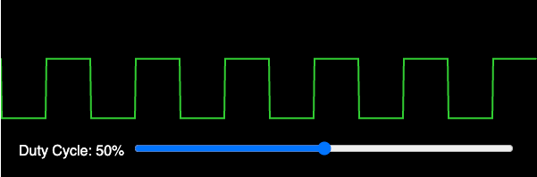

# PWM Lab



## Sample Prompt

```linenums="0"
We have created a hands-on lab that teaches
students what Pluse Width Modulation is
an how it is used to change the direction
and speed of a motor in a robot.

Our lab consists of a small plastic box with a
potentiometer on the front side and a 128x64
OLED display on the top of the box.

When the student turns the potentiometer, the
width of pulse on the display changes and the
brightness of an LED changes.

Please write a 5-minute dialog between a
teacher-volunteer-mentor and a 10-year old
student that is learning how STEM robots
work.  The goal is to understand how the
speed and direction of motors is controlled
in a simple $19 collision avoidance robot.
```

### Sample Response

**Teacher:** Hi there! I see you're turning that knob on our little box. Notice anything happening on the screen or the LED?

**Student:** Yeah, the LED gets brighter when I turn the knob one way, and dimmer when I turn it the other way. Also, I see the pattern on the screen changing. It's like little lines getting thicker or thinner.

**Teacher:** Exactly! That knob you're turning is called a potentiometer, and it changes something called the "duty cycle" of a signal. The pattern you see on the screen is a waveform, and when it gets "wider" at the top, that means the LED is on for a longer time. This method of controlling how long something is on versus off is called Pulse Width Modulation, or PWM for short.

**Student:** Pulse Width Modulation? Is that like turning it on and off really fast?

**Teacher:** You've got it! The idea is that we turn the power on and off so quickly that your eyes don't see the flicker, but instead notice a change in brightness. If the LED is on most of the time, it looks brighter. If it's off more than it's on, it looks dimmer.

**Student:** So if I can use PWM to control brightness, can I also use it to control the speed of the motors in the robot?

**Teacher:** Exactly! In our $19 collision avoidance robot, we use PWM signals to the motor. By changing how much of the time the motor is powered versus unpowered, we can make it spin faster or slower. High duty cycle---on longer---means faster speed. Lower duty cycle---on for a shorter time---means slower speed.

**Student:** That's cool! So if I turn the potentiometer, I could make the motor go slower or faster by changing the duty cycle?

**Teacher:** Yes, that's the idea. In this lab, you're seeing the concept with just an LED and a display. In the actual robot, there's code running on a microcontroller like the Raspberry Pi Pico. It takes your commands and sends PWM signals to the motor driver. The motor driver then controls how much current goes into the motors.

**Student:** What about making the robot go backward? Does PWM do that too?

**Teacher:** PWM mainly controls speed. To make the robot go forward or backward, we use an H-bridge circuit, which we learned about earlier. The H-bridge can reverse the direction of the current going through the motor. If the current flows one way, the motor spins forward; if it flows the other way, it spins backward.

**Student:** So direction is from the H-bridge, and speed is from PWM?

**Teacher:** Exactly! Think of the H-bridge as controlling left or right directions of traffic flow, and PWM as controlling how many cars are let through at a time. By combining these two techniques, we can make the robot's wheels spin in either direction and at different speeds.

**Student:** So the potentiometer on the lab box is like what the robot's computer does by itself?

**Teacher:** Yes, the robot's computer reads instructions from the code you write. Instead of you turning a knob, you'll write commands. The microcontroller will generate a PWM signal inside its tiny "brain" and send it out to the motors. If it wants to slow down, it reduces the duty cycle. If it wants to speed up, it increases the duty cycle.

**Student:** That's awesome. So just by using PWM and an H-bridge, I can make a robot move however I want?

**Teacher:** You got it. You can make it speed up, slow down, reverse direction, or even stop. Understanding PWM and H-bridges is a big step in learning how to control motors in robotics.

**Student:** I feel like a robot engineer already!

**Teacher:** You're well on your way! Now, keep experimenting with that potentiometer and watch how the waveform and LED brightness change. That's the first step to understanding how you'll control a real robot's motion.