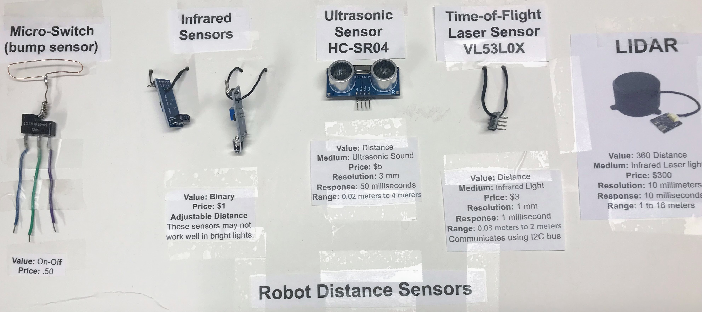

# Sensors

!!! prompt "Prompt Text"
    Above is an image of a poster board we are using
    for our Robot Day at our school to teach students
    about sensors.

    Please create a sample five-minute dialog between
    a teacher/volunteer/mentor and a student about this
    board and how we use time-of-flight sensors to
    measure the distance between our robot and the
    wall of the corral wall that encloses our robots.

## Response

**Teacher:** Hi there! Welcome to Robot Day! I see you're checking out our sensor board. Have you ever seen any of these sensors before?

**Student:** Not really. What do they all do?

**Teacher:** Great question! These sensors help robots sense the world around them. Some are really simple, like this **micro-switch**. When something presses on it, it acts like a bump sensor and tells the robot, "Hey, you hit something!" It's just an on-off signal.

**Student:** That's cool, but it seems pretty basic. What about the others?

**Teacher:** Good observation! As you go across the board, the sensors get more advanced. For example, this **infrared sensor** sends out invisible light and detects if something reflects it back. It's good for detecting obstacles, but it doesn't work well in bright sunlight.

**Student:** Okay, so it's more useful indoors?

**Teacher:** Exactly. Then we have the **ultrasonic sensor**, like this HC-SR04. It works like a bat! It sends out a high-pitched sound wave that humans can't hear, waits for it to bounce back, and calculates the distance to an object. This is great for measuring how far the robot is from a wall.

**Student:** That's so smart! Is that what you use in the robot corral?

**Teacher:** Actually, in our corral, we use a more advanced sensor called a **Time-of-Flight sensor**. It's this little one here, the VL53L0X. It works by sending out an infrared laser pulse and measuring how long it takes for the light to bounce back to the sensor. Since light travels incredibly fast, it can calculate the distance with amazing precision.

**Student:** Wow! So it's even faster than the ultrasonic sensor?

**Teacher:** Exactly. The ultrasonic sensor takes about 50 milliseconds to get a reading, while the Time-of-Flight sensor only takes 1 millisecond! That means it can react faster to changes, which is important when our robots are moving quickly.

**Student:** And it looks so small compared to the ultrasonic sensor!

**Teacher:** That's another advantage. Time-of-Flight sensors are tiny and lightweight, making them great for small robots. They also don't get confused by sound waves like the ultrasonic sensor might if there's a lot of noise in the room.

**Student:** What about this LIDAR? That looks even bigger.

**Teacher:** Good eye! LIDAR is like a Time-of-Flight sensor but on steroids. It spins around and measures distances in all directions, creating a 360-degree map of the robot's surroundings. It's super precise and can detect objects far away---up to 16 meters. But it's also very expensive, costing around $300, so it's not practical for small, low-cost robots like ours.

**Student:** Oh, so the Time-of-Flight sensor is better for our corral robots because it's small, fast, and affordable?

**Teacher:** You've got it! Our $19 collision-avoidance robots use these Time-of-Flight sensors to measure the distance to the walls of the corral. If the robot gets too close to a wall, the sensor tells it to stop and turn away before it bumps into anything.

**Student:** That makes sense. So each sensor has its own purpose, depending on the robot and what it needs to do.

**Teacher:** Exactly. Some sensors are simple and cheap, while others are more precise and expensive. For our robot corral, the Time-of-Flight sensor is the perfect balance of speed, size, and cost. Great questions! Keep exploring, and you'll be building your own robots in no time!

4o