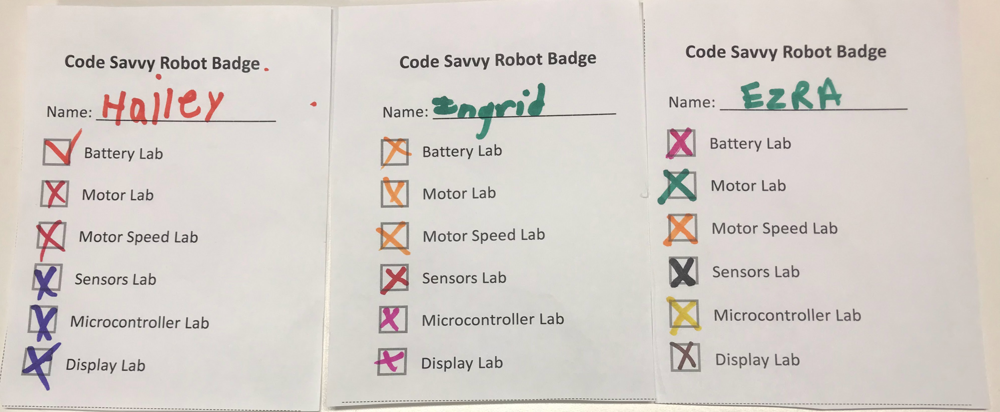

# Robot Day Tables

Tables are really just logical groupings of activities that start with simple concepts and build up to the full collision avoidance robot.  At most events, a table is a six-foot by 2.5-foot table with one or more hands-on activities on it.  How many activities you have per table will depend on your audience and the list of activities you have prepared for the Robot Day.

The focus is to get kids to use their hands and fingers to make a change and see how their actions change the world.  This can be seeing a motor spinning, an LED brightness change, a sensor showing a value, or a display changing a pattern.

The key is to design activities in that kids must use their bodies to interact
and trigger a change in what they see or hear.  They must be given time
to wiggle their hands to see how sensors can see the world around them.

## Welcome Table

This is the table that has both the student checklists and the badges.

{ width="200" }{ width="200" }

### Challenge Scripts for the Welcome Table

*"Do you like robots?"*

*"Would you like to take a robot challenge?"*

*If you complete all six challenges you will earn a "Robot Expert" sticker.*

If they say yes, guide them to the welcome table and strongly encourage them to put their name at the top of a checklist of six tables.

## Batteries Table

The batteries table is usually right after the welcome table.  Some events have the battery activities on
the same table as the welcome table.

Here is a sample board for the batteries table:

There are three other activities:

1. [Batteries](./activities/batteries.md)
2. [Battery Testing](./activities/battery-test.md)
3. [Battery Recharging](./activities/battery-recharging.md)

## Motors Table

We have many activities that accompany our motor table.
The [motors activities page](./activities/motors.md) will give you some ideas of projects to try.

Here are some short video demos of the project boxes:

<iframe width="560" height="315" src="https://www.youtube.com/embed/rtaaIjR2qmY?si=fbrPVj9-jZ8fV6aa" title="YouTube video player" frameborder="0" allow="accelerometer; autoplay; clipboard-write; encrypted-media; gyroscope; picture-in-picture; web-share" allowfullscreen></iframe>

<iframe width="560" height="315" src="https://www.youtube.com/embed/nNzxCF-I2EI?si=9O--6jT4SBVWNYBC" title="YouTube video player" frameborder="0" allow="accelerometer; autoplay; clipboard-write; encrypted-media; gyroscope; picture-in-picture; web-share" allowfullscreen></iframe>

* [H-Bridge](./activities/h-bridge.md)
* [Pulse Width Modulation](./activities/pwm.md)

## Sensors

* [Sensors](./activities/sensors.md)
* [Microswitch](./activities/microswitch.md)
* [Potentiometers](./activities/pot-lab.md)
* [Time of Flight](./activities/time-of-flight.md)
* [Moving Rainbow](./activities/moving-rainbow.md)

## Display Table

Our display table has about a dozen different types of robot displays.  We start out talking about how a single LED can tell you the status of a robot such as "I have power".  LEDs are very inexpensive (about a penny each) and easy to hook up.

From there we slowly build up to more complicated graphical displays.  Our favorite display is the 128x64 OLED display.  Our [robot faces](https://dmccreary.github.io/robot-faces/) use these displays.

[Displays](./activities/displays.md)

## MicroController Table

[Microcontrollers](./activities/microcontrollers.md)